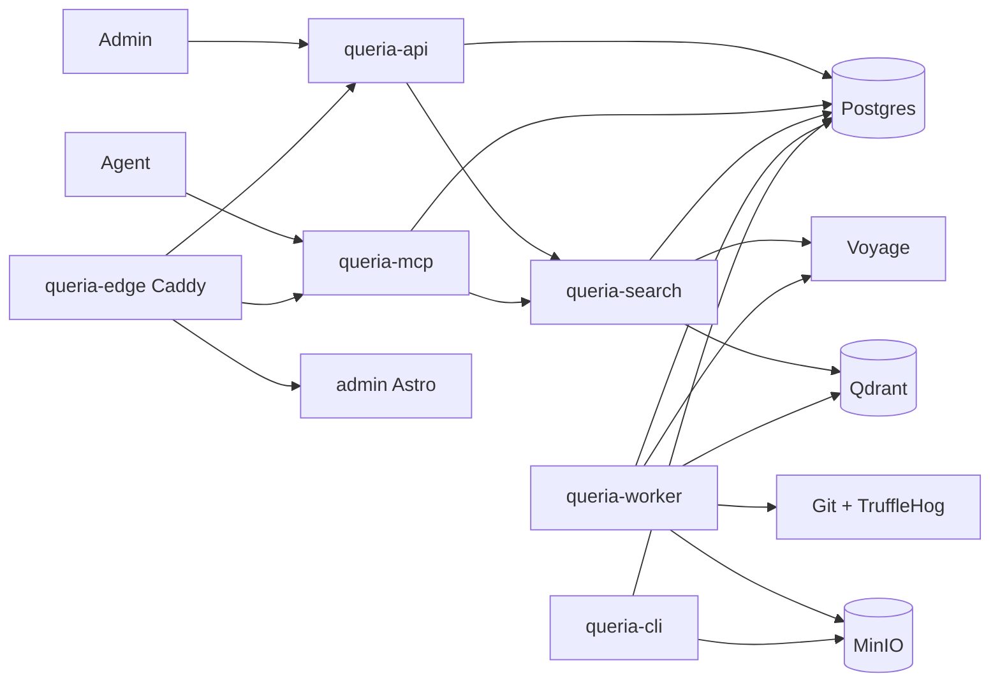
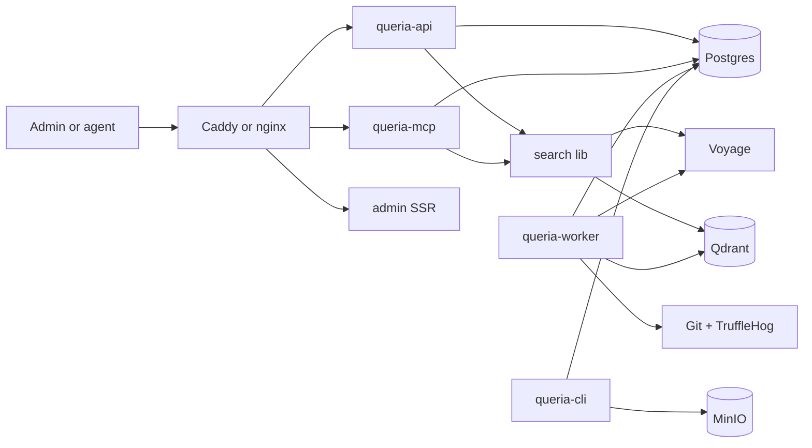

# Queria Architecture

> Status: CURRENT (as-is) + PLANNED (post-hard-cut)
> Last verified: 2026-07-16
> Runtime truth: [`HANDOFF.md`](./HANDOFF.md)
> Cut plan: [`SIMPLIFICATION.md`](./SIMPLIFICATION.md)

## As-is (2026-07-16)

### Crate map (as-is)

| Crate | Role | Notes |
|---|---|---|
| `queria-core` | Config, IDs, contracts, evaluation, JSON tracing | `proxy_addr` removed (P2); config still env-heavy but usable |
| `queria-auth` | Password, session, agent token | Still thin; optional later fold |
| `queria-db` | SQLx repos, migrations helpers | Dead traits removed (P1); god-file remains |
| `queria-search` | Voyage, Qdrant, hybrid RRF, evaluation executor | |
| `queria-api` | Axum Admin + agent HTTP | |
| `queria-mcp` | MCP over HTTP | |
| `queria-worker` | Ingestion + embedding + backup jobs | |
| `queria-ingestion` | Git allowlist, parse, TruffleHog gate | |
| `queria-cli` | Ops binary | |
| `queria-backup` | S3 backup, retention, restore drill | Drill is deferrable (P2) |
| edge | Caddy `docker/Caddyfile` | Replaces deleted `queria-proxy` / Pingora |

Admin: pure Astro SSR + CSS tokens (P0: React/Three.js/shadcn removed 2026-07-16).

## Post-hard-cut target

### Crate map (target)

| Keep | Change |
|---|---|
| `queria-core`, `queria-db`, `queria-search`, `queria-ingestion` | Shrink config; drop dead traits |
| `queria-api`, `queria-mcp`, `queria-worker`, `queria-cli` | Unchanged role |
| `queria-backup` | Keep backup/restore paths; quarantine restore-drill until ops needs it |
| `queria-observability` | **Done (P1):** `queria_core::init_json_tracing` |
| `queria-auth` | Optional later fold |
| `queria-proxy` | **Done (P1):** deleted; Caddy edge |

Admin: stat cards and SSR tables only (P0 applied).

### Edge routing (target)

| Path | Upstream |
|---|---|
| `/api/` | `queria-api` |
| `/mcp` | `queria-mcp` |
| `/admin`, `/` (UI) | admin |
| `/healthz` | edge-local 200 or api health |

## Explicit non-goals (post-cut)

- Multi vector DB product support (Qdrant only in Queria)
- Second edge binary inside the Rust workspace
- Evaluation Admin product surface as a default
- Decorative 3D visualization as a release gate
