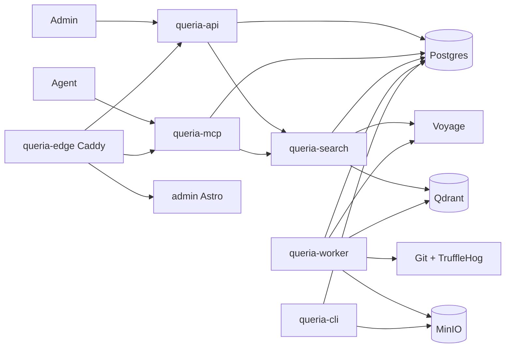
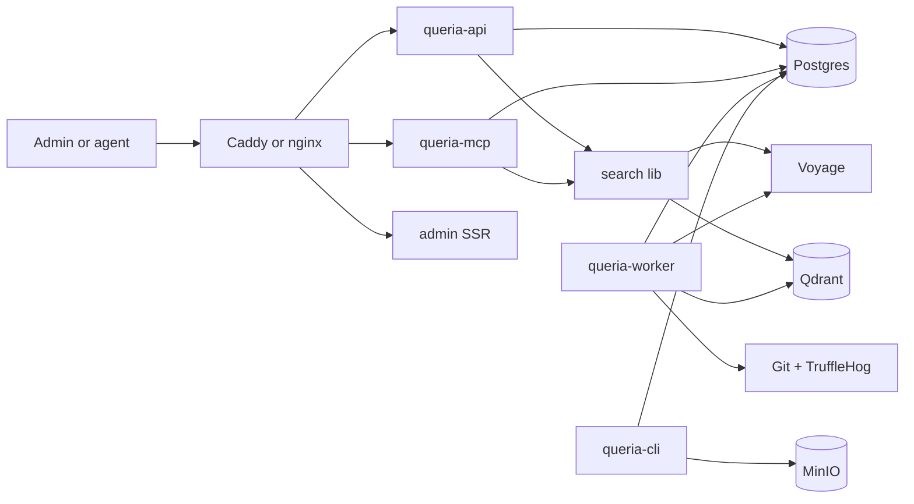
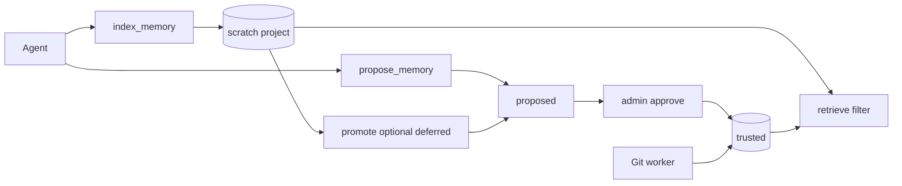

# Queria Architecture

> Status: CURRENT (as-is) + PLANNED (post-hard-cut + dual-lane)
> Last verified: 2026-07-18
> Runtime truth: [`HANDOFF.md`](./HANDOFF.md)
> Product contract: [`PRODUCT.md`](./PRODUCT.md)
> Cut plan: [`SIMPLIFICATION.md`](./SIMPLIFICATION.md)
> Backlog: [`IMPROVEMENTS.md`](./IMPROVEMENTS.md)

## As-is (2026-07-18)

### Crate map (as-is)

| Crate | Role | Notes |
|---|---|---|
| `queria-core` | Nested AppConfig groups, IDs, contracts, evaluation, auth, tracing | Auth folded; config split into domain settings |
| `queria-db` | SQLx repos, migrations helpers | repositories split: types/projects/auth |
| `queria-search` | Voyage, Qdrant, hybrid RRF, evaluation executor | |
| `queria-api` | Axum Admin + agent HTTP | |
| `queria-mcp` | MCP over HTTP | |
| `queria-worker` | Ingestion + embedding + backup jobs | |
| `queria-ingestion` | Git allowlist, parse, TruffleHog gate | |
| `queria-cli` | Ops binary | |
| `queria-backup` | S3 backup + retention | restore_drill moved to queria-cli |
| edge | Caddy `docker/Caddyfile` | Replaces deleted `queria-proxy` / Pingora |

Admin: pure Astro SSR + Violet Void CSS tokens (P0: React/Three.js/shadcn removed 2026-07-16). No React islands.

## Post-hard-cut target

### Crate map (target)

| Keep | Change |
|---|---|
| `queria-core`, `queria-db`, `queria-search`, `queria-ingestion` | Shrink config; drop dead traits |
| `queria-api`, `queria-mcp`, `queria-worker`, `queria-cli` | Unchanged role |
| `queria-backup` | Keep backup/restore paths; quarantine restore-drill until ops needs it |
| `queria-observability` | **Done (P1):** `queria_core::init_json_tracing` |
| `queria-auth` | **Done:** `queria_core::auth` |
| `queria-proxy` | **Done (P1):** deleted; Caddy edge |

Admin: stat cards and SSR tables only (P0 applied).

### Edge routing (target)

| Path | Upstream |
|---|---|
| `/api/` | `queria-api` |
| `/mcp` | `queria-mcp` |
| `/admin`, `/` (UI) | admin |
| `/healthz` | edge-local 200 or api health |

## Dual-lane knowledge (Slice A as-is + deferred)

Contract and rules: [`PRODUCT.md`](./PRODUCT.md). Backlog: `IMP-13`–`IMP-16` in [`IMPROVEMENTS.md`](./IMPROVEMENTS.md). Runtime: [`HANDOFF.md`](./HANDOFF.md).

**As-is (Slice A + retrieval quality shipped on local main):** MCP `index_memory` → scratch (project-scoped, sync embed); MCP `propose_memory` → approval → trusted; worker Git → trusted; retrieve with `include_scratch` default true (eval/CLI trusted-only). Pipeline: pool → RRF → hydrate → Voyage rerank (fail-open) → near-dup compress (**prefer trusted**). Admin Playground SSR. Prod image may lag.

**Still deferred:** Admin list/delete scratch (`IMP-15`); `promote_memory` (`IMP-16`). Prefer-trusted compress and rerank are **shipped** (`IMP-01`/`IMP-02`), not deferred.

Write paths:

| Concern | Pre–Slice A | Slice A (now) | Deferred |
|---|---|---|---|
| Agent direct write | No | Yes → **scratch** only, project-scoped | — |
| Trusted write | Approve or trusted Git | Unchanged | — |
| Global | Trusted standards | Still trusted-only; no scratch global | — |
| Qdrant / FTS filter | org, project, status, approved | + status `scratch` / lane filters | — |
| Eval / golden | Approved knowledge | Trusted lane only (`include_scratch=false`) | — |
| Rank / near-dup | RRF only | RRF + rerank + compress prefer trusted (local main; prod may lag) | Durable metrics (IMP-04) |
| Admin scratch / promote | N/A | N/A | IMP-15 / IMP-16 |

Crate impact (Slice A): `queria-db` migrations + hybrid filters; `queria-search` scratch embed + retrieval; `queria-mcp` `index_memory`; `queria-core` `IndexMemory` permission + contracts.

## Explicit non-goals (post-cut)

- Multi vector DB product support (Qdrant only in Queria)
- Second edge binary inside the Rust workspace
- Evaluation Admin product surface as a default
- Decorative 3D visualization as a release gate
- Agent direct write into **trusted** or **global** (scratch lane only)
- Full enowx multi-store / one-binary product shape
