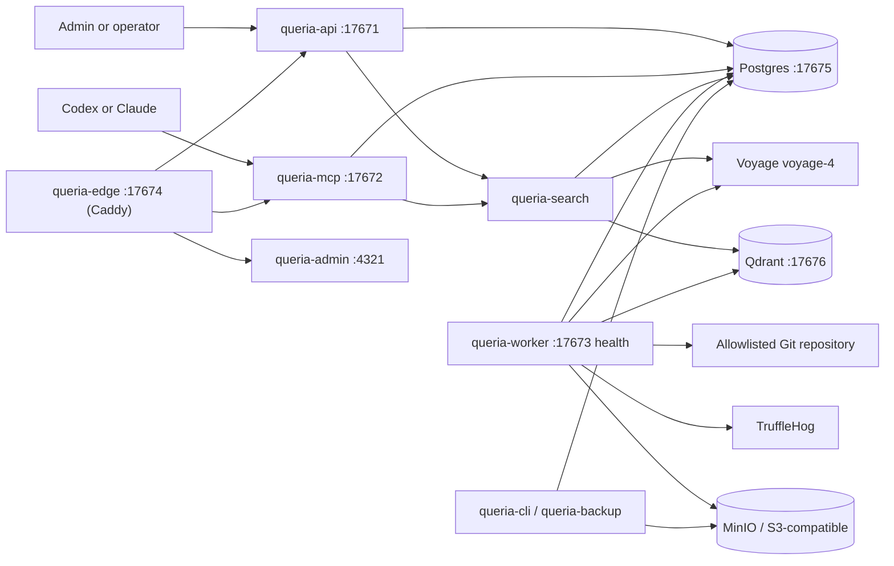

# Queria Backend Handoff

> Last verified: 2026-07-17 (ops acceptance measure-only pack on production)
> Branch: `main`
> Local workspace commit at measure time: see `git log` (docs residual update for prod ops pack)
> Docs pack: post–ponytail-audit living docs (PRODUCT, ARCHITECTURE, SIMPLIFICATION, DOCS_POLICY); historical plans archived.
> SIMPLIFICATION P0 applied: Admin dashboard is stat cards only (Three.js + unused shadcn/React islands removed).
> SIMPLIFICATION P1 applied: Caddy edge (no Pingora/`queria-proxy`); observability folded into core; dead db traits removed.
> SIMPLIFICATION P2–P3 applied: Admin eval UI deferred (CLI kept); `proxy_addr` removed; enowx-rag Qdrant-only.
> **Production host still runs pre-Caddy image** (`queria-proxy` container, image `queria-backend:latest` built 2026-07-08); code-side Caddy is not redeployed yet.

This is the canonical continuation document for Queria backend work. It
separates implemented behavior from approved target-state design. When other
product docs disagree with this file, prefer this handoff.

Living companion docs: [`PRODUCT.md`](./PRODUCT.md), [`ARCHITECTURE.md`](./ARCHITECTURE.md),
[`SIMPLIFICATION.md`](./SIMPLIFICATION.md), [`IMPROVEMENTS.md`](./IMPROVEMENTS.md),
[`DOCS_POLICY.md`](./DOCS_POLICY.md).

## Product Contract

Queria centralizes organization-wide and project-specific knowledge for humans
and AI agents. Full contract: [`PRODUCT.md`](./PRODUCT.md).

**Implemented today:** agents call `retrieve_context` before work and may call
`propose_memory` after work. Permanent **trusted** memory enters normal retrieval
only through approval or a trusted Git ingestion pipeline.

**Approved, not implemented:** dual-lane **scratch** agent memory (`index_memory`,
project-scoped direct write) so agents can persist searchable notes without
approval, without writing into trusted/global team truth. See PRODUCT lanes and
[`IMPROVEMENTS.md`](./IMPROVEMENTS.md) `IMP-13`–`IMP-16`.

Knowledge scopes (as-is + target):

- `global`: reusable coding, security, deployment, SOP standards (**trusted only**; no scratch global).
- `project`: project trusted knowledge; after dual-lane also that project’s scratch.
- `include_global=true` still requires token permission; project-only tokens cannot retrieve global knowledge.
- `include_scratch` (planned): default true for agent retrieve; false for trusted-only probes.

## Repository Boundaries

| Path | Git status | Responsibility |
|---|---|---|
| `queria/backend` | Git repository, `main` tracks `origin/main` | Rust backend, migrations, runtime runbooks, HANDOFF + SIMPLIFICATION. |
| `queria` | Not a Git repository | Product overview and local workspace grouping. |
| workspace `docs/` | Not a Git repository | Product REFERENCE research, UI flow, MCP client notes, thin mirrors. |

Do not assume parent-workspace documents are present in a standalone backend
clone. This handoff and [`SIMPLIFICATION.md`](./SIMPLIFICATION.md) contain the
required next-step context for ops acceptance and complexity cuts.

## Implemented Architecture



The Rust workspace uses edition 2024 and contains nine crates:
`queria-core` (auth + observability), `queria-db`, `queria-search`,
`queria-api`, `queria-mcp`, `queria-worker`, `queria-ingestion`,
`queria-cli`, and `queria-backup`. Public edge is Caddy (`docker/Caddyfile`),
not a Rust proxy crate.

## Completion Matrix

### Backend Capability

| Capability | Status | Evidence or gap |
|---|---|---|
| Rust workspace and binaries | `COMPLETED` | API, MCP, worker, and CLI binaries compile in one workspace (edge is Caddy). |
| Runtime config and JSON logging | `COMPLETED` | Environment-driven config and tracing JSON are implemented. |
| Postgres, Qdrant, MinIO local infrastructure | `COMPLETED` | `docker-compose.yml` exposes ports `17675`-`17679`. |
| Baseline schema and migrations | `COMPLETED` | Eight bundled migrations cover baseline, sessions, source indexes, ingestion, hybrid retrieval, retry backoff, evaluation reports, and backup records. |
| First-run setup and local login/session | `COMPLETED` | Setup token, first admin, password hashing, login, cookie session, and `/me` exist. |
| Projects and source registry API | `COMPLETED` | List/create/get project and register/list/get source are DB-backed. |
| Approval flow | `COMPLETED` | List/detail/approve/reject, initial chunk creation, and audit events exist. |
| Git ingestion MVP | `COMPLETED` | Allowlist validation, TruffleHog gate, parser/chunker, stale cleanup, trusted auto-approval, and job lifecycle exist. |
| Voyage-4 and Qdrant clients | `COMPLETED` | Provider clients, collection setup, durable jobs, and backfill are implemented. |
| Hybrid retrieval and RRF | `COMPLETED` | Semantic plus Postgres FTS works with strict-weighted relaxed OR query fallback. |
| Embedding pacing and graceful stop | `COMPLETED` | Paced batches requeue and unlock jobs instead of sleeping while holding a running job. |
| Evaluation baseline | `COMPLETED` (CLI) | Shared executor via `queria-cli eval run`; Admin evaluation HTTP routes removed. |
| MCP HTTP transport | `COMPLETED` | `initialize`, `tools/list`, and `tools/call` work with agent-token authorization. |
| MCP agent tools | `COMPLETED` | Agent surface: `retrieve_context`, `search_knowledge`, `propose_memory`, `list_projects`, `get_source`. Maintainer actions (approve/reject, reindex, token admin) stay on session Admin HTTP API by design, not MCP. |
| Admin-oriented API | `COMPLETED` | Dashboard, audit logs, approvals, jobs, sources, tokens (no evaluations HTTP). |
| Edge reverse proxy | `COMPLETED` | Caddy path router (`docker/Caddyfile`) for `/api/`, `/mcp`, admin, and health on host port `17674`. Pingora/`queria-proxy` removed in P1. |
| Astro Admin UI | `COMPLETED` | Sahara SSR pages; pure Astro (no React islands). SIMPLIFICATION P0 applied 2026-07-16. |
| S3 backup and restore drill | `COMPLETED` | Backup in `queria-backup`; restore-drill lives only in `queria-cli` (removed from lib). Live empty-volume restore remains acceptance. |
| Production OCI packaging | `COMPLETED` | Dockerfiles, production Compose, deployment/rollback runbooks. Stack is deployed; Phase 7 acceptance pack still open. |

### Human UI Screens

| Screen / surface | Status | Entry point / honesty note |
|---|---|---|
| Setup Wizard | `COMPLETED` | `/admin/setup` |
| Login / Logout | `COMPLETED` | `/admin/login`, `/admin/logout` |
| Dashboard | `COMPLETED` | `/admin/dashboard` stat cards + embedding bar + latest job/eval panels |
| Projects | `COMPLETED` | `/admin/projects` with create-project dialog |
| Sources | `COMPLETED` | `/admin/sources`, `/admin/sources/detail` (embedding counts on source detail) |
| Knowledge Items | `COMPLETED` | `/admin/knowledge` |
| Approval Queue | `COMPLETED` | `/admin/approvals` |
| Ingestion Jobs | `COMPLETED` | `/admin/jobs` (primary place for job lifecycle; embedding work shows up as jobs) |
| Embedding Status | `EMBEDDED` | No dedicated `/admin/embedding` route. Visible via dashboard summary, source detail chunk-state counts, jobs list, and CLI `embeddings status`. |
| Retrieval Probe | `EMBEDDED` | No dedicated `/admin/retrieval-probe` route. Operator probe/eval path is Evaluation + CLI `retrieval probe`. |
| Agent Tokens | `COMPLETED` | `/admin/tokens` |
| Audit Logs | `COMPLETED` | `/admin/audit` |
| Evaluation | `CLI` | Admin page + evaluation HTTP removed. Run `queria-cli eval run --project <slug>`; dashboard may show last report if present |
| Backup/Restore | `API/CLI` | No dedicated Admin UI page. Backup/restore is CLI + `queria-backup` + runbook. |

## Production Host

| Field | Value |
|---|---|
| Public IP | `168.110.214.130` |
| SSH user | `ubuntu` |
| Hostname | `instance-20260518-2039` (Oracle Cloud aarch64) |
| OS | Ubuntu 24.04 (kernel `6.17.0-1016-oracle`) |
| Deploy path | `/home/ubuntu/queria-backend` |
| Compose file | `docker-compose.production.yml` (also legacy copy under `/home/ubuntu/queria`) |
| Local SSH private key | workspace root `ssh-key-2026-04-16.key` (mode `600`; never commit) |
| Local SSH public key | workspace root `ssh-key-2026-04-16.key.pub` |

Connect:

```bash
ssh -i /Users/fernandojulian/project/knowledge-based-rag/ssh-key-2026-04-16.key ubuntu@168.110.214.130
```

### Stack identity (measured 2026-07-17, read-only)

| Field | Value |
|---|---|
| Host deploy path | `/home/ubuntu/queria-backend` |
| Host git HEAD | `7ad381d` (`docs: update verified commit in HANDOFF.md`, 2026-07-08) |
| Runtime `QUERIA_SOURCE_COMMIT` | `9506047` (image build label; differs from host checkout) |
| Image | `queria-backend:latest` (`sha256:d517c6ea89a0…`, created 2026-07-08T12:45Z, ~116 MB) |
| Edge service (live) | `queria-backend-queria-proxy-1` maps host `17674` (legacy Rust proxy; **not** Caddy/`queria-edge` yet) |
| API / MCP / worker / admin | all `Up 8+ days` on measure day (no ops restart) |
| Postgres / Qdrant | `healthy` |
| MinIO | `Up` |
| Schema | `_queria_migration` versions `20260704000100`–`20260705000100` (8 rows; baseline through backup_records). No dual-lane/`scratch` migration on prod. |
| Org | `fjulian` (1 user/admin present; setup already consumed 2026-07-08) |
| Projects | **0** (slug `fjulian-me` **does not exist** on prod) |

Verified live stack on 2026-07-17 (containers still up ~8 days; not recreated by ops pack):

| Service | Notes |
|---|---|
| `queria-backend-queria-proxy-1` | Public host port `17674` (legacy proxy image) |
| `queria-backend-queria-api-1` | Internal only; contains `/usr/local/bin/queria-cli` |
| `queria-backend-queria-mcp-1` | Internal only |
| `queria-backend-queria-worker-1` | Internal only |
| `queria-backend-queria-admin-1` | Internal (`4321` in container) |
| `queria-backend-postgres-1` | Healthy |
| `queria-backend-qdrant-1` | Healthy |
| `queria-backend-minio-1` | Running |

Proxy health on the host (2026-07-17 ops pack):

```bash
curl -sS -o /tmp/healthz.out -w "%{http_code}" http://127.0.0.1:17674/healthz
# http_code=200 body=OK
```

Host resource snapshot (2026-07-16 notes still apply): ~11 GiB RAM, ~188G disk with ~145G free, Docker 29.5.0.

Same host also runs unrelated shared workloads (monitoring, other app DBs, `grok2api`, etc.). Do not treat the box as Queria-only when planning ports, disk, or restarts.

### Mission ops acceptance pack (2026-07-17, measure-only)

**Allowed write:** exactly one `eval run --project fjulian-me` attempt.  
**Forbidden (not done):** deploy, container restart/recreate, migrate, backfill enqueue, restore, schema change, dual-lane/`index_memory` on prod.

| Check | Command (on host / container) | Result |
|---|---|---|
| Edge healthz | `curl` `http://127.0.0.1:17674/healthz` | **HTTP 200**, body `OK` |
| Containers | `docker ps` / `docker compose ps` | proxy/api/mcp/worker/admin/postgres/qdrant/minio **Up**; postgres+qdrant healthy |
| Embeddings status | `docker exec --env-file …/.env queria-backend-queria-api-1 queria-cli embeddings status --project fjulian-me` | **exit 1** `admin or project not found` (admin email matches user; **project missing**) |
| Embeddings residual (SQL equivalent) | counts from empty `chunk` table + zero projects | see table below |
| Retrieval probe | `queria-cli retrieval probe --project fjulian-me --query "deployment and site build notes" --limit 5` | **exit 1** same error (second control query also exit 1; no knowledge mutation) |
| Golden eval (once) | `queria-cli eval run --project fjulian-me` with golden file mounted from host `tests/golden_questions` | **exit 1** same error; **no** `evaluation_report` row inserted |

**Production embeddings residual for `fjulian-me` (2026-07-17):**

```json
{
  "project": "fjulian-me",
  "project_exists": false,
  "embedding_profile_version": "voyage-4-1024-v1",
  "counts": {
    "ready": 0,
    "pending": 0,
    "failed": 0,
    "processing": 0,
    "stale": 0
  },
  "org_projects_total": 0,
  "chunks_total_all_projects": 0,
  "cli_exit": 1,
  "cli_error": "admin or project not found"
}
```

**Probe notes:** CLI could not resolve project `fjulian-me`. No ranked hits structure returned (pre-retrieve failure). Knowledge/chunk/job counts stayed at 0 before and after probes. Classified read-ish (no backfill enqueue).

**Eval (exactly one attempt this session):**

| Field | Value |
|---|---|
| Project | `fjulian-me` |
| Total / passed / failed | **N/A** (did not enter EvaluationExecutor; no report insert) |
| Regression score | **N/A** |
| Failing questions | N/A |
| `evaluation_report` rows after run | **0** |
| Mission note | Single prod eval command only; not re-run for score shopping. Content DoD (e.g. 3/3) **not met**. |

**Ops open issues (honest; do not close Phase 7):**

1. **Prod has no projects and no knowledge** — setup/admin exists for org `fjulian`, but `project`/`knowledge_item`/`chunk`/`source_document`/`ingestion_job`/`agent_token`/`evaluation_report` are all empty. Status/probe/eval for `fjulian-me` cannot pass until project is created and trusted knowledge is ingested (explicit mid-mission approval required; out of this ops pack).
2. **Runtime edge is still `queria-proxy`**, not Caddy `queria-edge`. Repo P1 Caddy work is local-side; production image/redeploy not done.
3. **API container env incomplete vs host `.env`** — container process env lacked `QUERIA_FIRST_ADMIN_EMAIL` (CLI needed `--env-file` from host). Prefer aligning compose `env_file` on next approved redeploy.
4. **Historical local embedding residual** (2026-07-05 ready 344 / pending 717 / failed 168) is **local only**; do not use it as production truth.
5. **No dual-lane on prod** — intentional; Slice A remains local-only this mission.

Do not create projects, enqueue backfill, migrate, or redeploy without explicit user approval.

Security:

- Never paste the RSA private key into git, chat history, or docs beyond the local path above.
- Workspace `.gitignore` already ignores `*.key`.
- Prefer Infisical for app secrets; host `.env` files are emergency/runtime only.

## Current Local State

The first project is `fjulian-me`, sourced from:

```text
/Users/fernandojulian/project/fjulian/fjulian.me
```

**Historical local** embedding snapshot observed on 2026-07-05 (not production):

| State | Count |
|---|---:|
| `ready` | 344 |
| `pending` | 717 |
| `failed` | 168 |
| `processing` | 0 |
| `stale` | 0 |

The latest `embedding_backfill` job is `queued`, attempt `12`, with no worker
lock. Historical failed chunks remain retryable.

`README.md` specifically has 10 ready, 12 pending, and 2 failed chunks. The
`README.md: Deployment` chunk is pending, while other build/deployment chunks
are already ready.

**Production (2026-07-17):** project `fjulian-me` absent; all embedding counts 0 (see Mission ops acceptance pack).

## Latest Verified Retrieval Finding

Historical gap (pre-Phase-1): the golden query `deployment and site build notes`
failed under strict-only `websearch_to_tsquery('simple', $query)` because
`simple` kept `and` and AND-combined every term.

**Resolved in code:** hybrid lexical SQL now uses strict-weighted matches plus a
bounded relaxed OR path; RRF still combines lexical and semantic rankings.
Auth, approved status, active source, organization, project, and global-scope
filters remain inside both SQL paths.

Re-verify on current production data after embedding backfill; do not treat the
old 2/3 failure as the live default without a fresh probe.

## Latest Evaluation Result

### Production ops acceptance (2026-07-17) — one allowed run

Command (on prod host; used host `.env` + golden file from deploy tree):

```bash
docker run --rm --network container:queria-backend-queria-api-1 \
  --env-file /home/ubuntu/queria-backend/.env \
  -v /home/ubuntu/queria-backend/tests:/workdir/tests:ro \
  -w /workdir --entrypoint /usr/local/bin/queria-cli \
  queria-backend:latest eval run --project fjulian-me
```

Observed:

- CLI exit: **1**
- Error: `admin or project not found` (project `fjulian-me` missing; admin email matches DB user)
- total / passed / failed: **not computed**
- regression score: **N/A**
- `evaluation_report` insert: **none** (0 rows after attempt)
- **Not** a second run; Phase 7 golden 3/3 remains open

### Historical local only (2026-07-05)

Command:

```bash
rtk infisical run --env=dev -- cargo run -p queria-cli -- eval run --project fjulian-me
```

Observed then:

- total: 3
- passed: 2
- failed: 1
- regression score: `0.77777773`
- failed question: `deployment and site build notes`

**Code status since then:** CLI and HTTP share `EvaluationExecutor` and both
persist reports. Do **not** close Phase 7 on the historical local 2/3 result alone.
Production re-measure (above) did not produce a content score either.

## Operational Commands

Start infrastructure:

```bash
rtk docker compose up -d postgres qdrant minio
```

Run migrations:

```bash
rtk infisical run --env=dev -- cargo run -p queria-cli -- database migrate
```

Run a bounded worker pass:

```bash
rtk infisical run --env=dev -- /usr/bin/env \
  QUERIA_EMBEDDING_BATCH_SIZE=8 \
  QUERIA_EMBEDDING_REQUEST_INTERVAL_MS=30000 \
  cargo run -p queria-worker
```

Check embedding state:

```bash
rtk infisical run --env=dev -- cargo run -p queria-cli -- embeddings status --project fjulian-me
```

Run quality gates:

```bash
rtk cargo fmt --all --check
rtk cargo test --workspace
rtk cargo clippy --workspace --all-targets --all-features -- -D warnings
rtk git diff --check
```

## Security Boundaries

- Never commit provider keys, Cloudflare credentials, setup tokens, sessions, or agent tokens.
- Infisical is the primary runtime secret source; `.env` remains local fallback only.
- Raw agent tokens are shown once; Postgres stores token prefix and hash.
- Project Git paths and SSH repositories must pass explicit allowlists.
- TruffleHog must pass before trusted Git auto-approval.
- Agent proposals never receive trusted Git auto-approval.
- Global retrieval requires both `include_global=true` and token permission.
- Database writes, migrations, dependency additions, pushes, and deployments require explicit approval.

## Residual Gaps (current)

| Gap | Priority | Notes |
|---|---|---|
| Production empty seed | **Blocking DoD** | Measured 2026-07-17: 0 projects, 0 chunks, 0 eval reports. Create `fjulian-me`, register Git source, ingest, embed (requires approved ops; not done in measure pack). |
| Production embeddings residual | High | Production counts for `fjulian-me`: all **0** (project missing). Historical local 344/717/168 is not prod. After seed, re-run `embeddings status` and bounded backfill if needed. |
| Production acceptance pack | High | **Still open.** Healthz 200 + stack identity recorded 2026-07-17. Status/probe/eval blocked on missing project. DoD (eval 3/3, MCP client accept, backup restore, SLO spot-check) not closed. |
| Edge still `queria-proxy` | High | Live host uses legacy proxy service; Caddy/`queria-edge` only in repo until approved redeploy. |
| Prod container env drift | Medium | CLI needed host `--env-file` for `QUERIA_FIRST_ADMIN_EMAIL` (missing in bare container env). Fix on next compose/redeploy approval. |
| Hard simplification cuts | Done (P0–P3) | See [`SIMPLIFICATION.md`](./SIMPLIFICATION.md). Ops acceptance content DoD still open. |
| Admin UI dedicated routes | Low | Embedding / retrieval probe / backup are embedded or CLI-only (see screen matrix). Optional polish only. |
| Maintainer MCP tools | Deferred by design | Approve/reject/reindex/token admin remain Admin HTTP; agent MCP stays five tools. |
| Future product improvements | REFERENCE backlog | Dual-lane local Slice A is a separate track; do not require on prod for ops. [`IMPROVEMENTS.md`](./IMPROVEMENTS.md) / [`PRODUCT.md`](./PRODUCT.md). |

## Post-audit simplification

Ponytail-audit (over-engineering) findings are tracked in
[`SIMPLIFICATION.md`](./SIMPLIFICATION.md). Hard mode agreed cuts:

| Band | Intent | Status |
|---|---|---|
| P0 | Drop dead shadcn kit + Three.js dashboard graph | **DONE** 2026-07-16 |
| P1 | Replace Pingora with Caddy; fold observability; prune dead db traits | **DONE** 2026-07-16 |
| P2 | Defer evaluation Admin UI + HTTP; restore-drill CLI-only; drop `proxy_addr` | **DONE** 2026-07-16 |
| P3 | enowx-rag Qdrant-only; remove Chroma/pgvector/OpenAI stubs | **DONE** 2026-07-16 |
| Closeouts | mockall demotion, runbook sync, leftover trait/cfg work | **DONE** 2026-07-16 |
| Impact | Fold auth into core; demote search mockall to dev-deps via hand fakes | **DONE** 2026-07-16 |
| Deep cuts | Kill mockall; nest AppConfig; split repositories; move restore_drill to CLI | **DONE** 2026-07-16 |

Do not treat archived e2e plans under [`archive/superpowers/`](./archive/superpowers/)
as the active roadmap.

## Continue From Here

Feature scaffolding for Phases 1–6 is done. Immediate work:

**Ops acceptance (status after 2026-07-17 measure pack)**

1. ~~Measure edge health + stack identity~~ **done** (healthz 200; residual recorded above).
2. ~~Attempt embeddings status / probe / one eval for `fjulian-me`~~ **done** (all blocked: project absent; honest residual recorded).
3. **Needs approval:** create project `fjulian-me`, register allowlisted Git source, run trusted ingestion + embedding, then re-run status, probe, and **one** eval; update scores here.
4. **Needs approval:** redeploy Caddy edge (`queria-edge`) and align container `env_file` with host `.env`.
5. Remaining acceptance: MCP client smoke, scopes, backup restore drill, SLO spot-check (still open).

**Post-cut**

6. SIMPLIFICATION P0–P3 applied 2026-07-16; production host still on pre-Caddy proxy image until redeploy approval.
7. Keep maintainer tools off the agent MCP surface unless product requires otherwise.

**Product improvements (local dual-lane can proceed independently of prod seed)**

8. Backlog in [`IMPROVEMENTS.md`](./IMPROVEMENTS.md): dual-lane (`IMP-13`–`16`), packaging/filters (`IMP-17`–`19`), then write quality / docs / quotas (`IMP-21`–`26`), plus earlier quality IMP-01–12. Contract: [`PRODUCT.md`](./PRODUCT.md). Do not mark done without updating this handoff.

