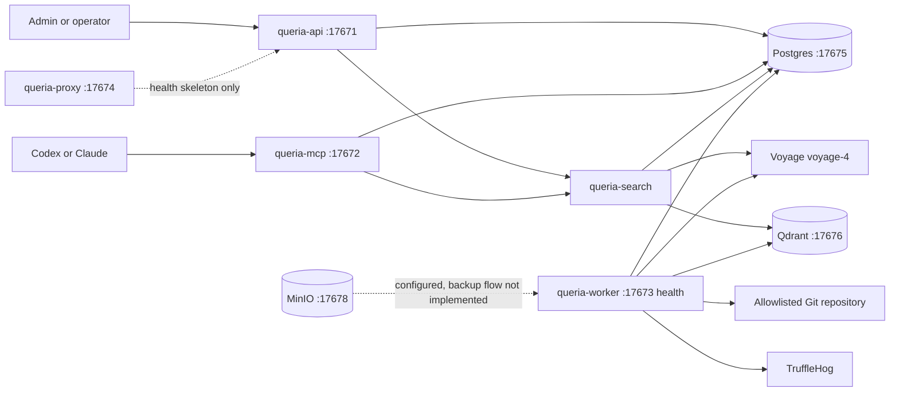

# Queria Backend Handoff

> Last verified: 2026-07-08
> Branch: `main`
> Verified commit: `471283e` (fix(prod): resolve first-run setup wizard token check and proxy csrf forwarding)

This is the canonical continuation document for Queria backend work. It
separates implemented behavior from approved target-state design.

## Product Contract

Queria centralizes organization-wide and project-specific knowledge for humans
and AI agents. Every agent should call `retrieve_context(project_id, query)`
before work and may call `propose_memory` after work. Permanent memory enters
normal retrieval only through approval or a trusted Git ingestion pipeline.

Knowledge scopes:

- `global`: reusable coding, security, deployment, SOP, and operational standards.
- `project`: business flow, technical decisions, integrations, incidents, gotchas, and domain notes for one project.
- `include_global=true` still requires token permission; project-only tokens cannot retrieve global knowledge.

## Repository Boundaries

| Path | Git status | Responsibility |
|---|---|---|
| `queria/backend` | Git repository, `main` tracks `origin/main` | Rust backend, migrations, runtime runbooks, active implementation plan. |
| `queria` | Not a Git repository | Product overview and local workspace grouping. |
| workspace `docs/` | Not a Git repository | Product target-state spec, research, UI flow, MCP client references. |

Do not assume parent-workspace documents are present in a standalone backend
clone. This handoff and the active plan therefore contain all required next-step
context.

## Implemented Architecture



The Rust workspace uses edition 2024 and contains eleven crates:
`queria-core`, `queria-auth`, `queria-db`, `queria-search`,
`queria-observability`, `queria-api`, `queria-mcp`, `queria-worker`,
`queria-ingestion`, `queria-proxy`, and `queria-cli`.

## Completion Matrix

### Backend Capability

| Capability | Status | Evidence or gap |
|---|---|---|
| Rust workspace and binaries | `COMPLETED` | API, MCP, worker, proxy, and CLI binaries compile in one workspace. |
| Runtime config and JSON logging | `COMPLETED` | Environment-driven config and tracing JSON are implemented. |
| Postgres, Qdrant, MinIO local infrastructure | `COMPLETED` | `docker-compose.yml` exposes ports `17675`-`17679`. |
| Baseline schema and migrations | `COMPLETED` | Seven bundled migrations cover baseline, sessions, source indexes, ingestion, hybrid retrieval, retry backoff, and evaluation reports. |
| First-run setup and local login/session | `COMPLETED` | Setup token, first admin, password hashing, login, cookie session, and `/me` exist. |
| Projects and source registry API | `COMPLETED` | List/create/get project and register/list/get source are DB-backed. |
| Approval flow | `COMPLETED` | List/detail/approve/reject, initial chunk creation, and audit events exist. |
| Git ingestion MVP | `COMPLETED` | Allowlist validation, TruffleHog gate, parser/chunker, stale cleanup, trusted auto-approval, and job lifecycle exist. |
| Voyage-4 and Qdrant clients | `COMPLETED` | Provider clients, collection setup, durable jobs, and backfill are implemented. |
| Hybrid retrieval and RRF | `COMPLETED` | Semantic plus Postgres FTS works with strict-weighted relaxed OR query fallback. |
| Embedding pacing and graceful stop | `COMPLETED` | Paced batches requeue and unlock jobs instead of sleeping while holding a running job. |
| Evaluation baseline | `COMPLETED` | Shared evaluation executor handles runs from both API and CLI and persists reports. |
| MCP HTTP transport | `COMPLETED` | `initialize`, `tools/list`, and `tools/call` work with agent-token authorization. |
| MCP tools | `COMPLETED` | `retrieve_context`, `search_knowledge`, `propose_memory`, `list_projects`, and `get_source` have real handlers. |
| Admin-oriented API | `COMPLETED` | Complete set of admin APIs for dashboard, audit logs, evaluations, approvals, and jobs. |
| Pingora reverse proxy | `COMPLETED` | Integrated Pingora reverse proxy with upstream routing and path rules. |
| Astro Admin UI | `COMPLETED` | Fully built with Sahara Design System, integrated, and verified with Playwright. |
| S3 backup and restore drill | `COMPLETED` | S3 backup/restore for PG/Qdrant and automated restoration drill. |
| Production OCI deployment | `COMPLETED` | Dockerfiles, production Compose stacks, and deployment runbooks are ready. |

### Human UI Screens

| Screen | Status | Backend readiness |
|---|---|---|
| Setup Wizard | `COMPLETED` | Fully implemented, styled with Sahara tokens, and validated. |
| Projects | `COMPLETED` | Fully implemented, styled with Sahara tokens, and validated. |
| Sources | `COMPLETED` | Fully implemented, styled with Sahara tokens, and validated. |
| Knowledge Items | `COMPLETED` | Fully implemented, styled with Sahara tokens, and validated. |
| Approval Queue | `COMPLETED` | Fully implemented, styled with Sahara tokens, and validated. |
| Ingestion Jobs | `COMPLETED` | Fully implemented, styled with Sahara tokens, and validated. |
| Embedding Status | `COMPLETED` | Fully implemented, styled with Sahara tokens, and validated. |
| Retrieval Probe | `COMPLETED` | Fully implemented, styled with Sahara tokens, and validated. |
| Agent Tokens | `COMPLETED` | Fully implemented, styled with Sahara tokens, and validated. |
| Audit Logs | `COMPLETED` | Fully implemented, styled with Sahara tokens, and validated. |
| Evaluation | `COMPLETED` | Fully implemented, styled with Sahara tokens, and validated. |
| Backup/Restore | `COMPLETED` | Fully implemented, styled with Sahara tokens, and validated. |

## Current Local State

The first project is `fjulian-me`, sourced from:

```text
/Users/fernandojulian/project/fjulian/fjulian.me
```

Embedding snapshot observed on 2026-07-05:

| State | Count |
|---|---:|
| `ready` | 344 |
| `pending` | 717 |
| `failed` | 168 |
| `processing` | 0 |
| `stale` | 0 |

The latest `embedding_backfill` job is `queued`, attempt `12`, with no worker
lock. Historical failed chunks remain retryable.

`README.md` specifically has 10 ready, 12 pending, and 2 failed chunks. The
`README.md: Deployment` chunk is pending, while other build/deployment chunks
are already ready.

## Latest Verified Retrieval Finding

The golden query `deployment and site build notes` currently fails lexical
retrieval because Postgres uses:

```sql
websearch_to_tsquery('simple', $query)
```

Postgres parses that query as:

```text
'deployment' & 'and' & 'site' & 'build' & 'notes'
```

The `simple` dictionary keeps `and`, and web-search terms are combined strictly.
No single chunk contains every lexeme, so lexical candidate count is zero.
The source content is valid and contains a Deployment section; this is a
retrieval-query strategy gap, not a bad golden question.

Required fix: preserve strict ranking but add a bounded relaxed OR candidate
path, then let RRF combine lexical and semantic rankings. Authorization,
approved status, active source, organization, project, and global-scope filters
must remain inside both SQL paths.

## Latest Evaluation Result

Command:

```bash
rtk infisical run --env=dev -- cargo run -p queria-cli -- eval run --project fjulian-me
```

Observed result:

- total: 3
- passed: 2
- failed: 1
- regression score: `0.77777773`
- failed question: `deployment and site build notes`
- retrieval mode: `lexical_fallback`
- returned candidates/items: 0

The CLI prints a report but does not persist it. The HTTP `run` endpoint runs
and persists a separate report, while `latest` returns the newest persisted
row. Therefore CLI output and HTTP `latest` can legitimately differ today.
The active plan makes evaluation execution shared and persistence explicit.

## Operational Commands

Start infrastructure:

```bash
rtk docker compose up -d postgres qdrant minio
```

Run migrations:

```bash
rtk infisical run --env=dev -- cargo run -p queria-cli -- database migrate
```

Run a bounded worker pass:

```bash
rtk infisical run --env=dev -- /usr/bin/env \
  QUERIA_EMBEDDING_BATCH_SIZE=8 \
  QUERIA_EMBEDDING_REQUEST_INTERVAL_MS=30000 \
  cargo run -p queria-worker
```

Check embedding state:

```bash
rtk infisical run --env=dev -- cargo run -p queria-cli -- embeddings status --project fjulian-me
```

Run quality gates:

```bash
rtk cargo fmt --all --check
rtk cargo test --workspace
rtk cargo clippy --workspace --all-targets --all-features -- -D warnings
rtk git diff --check
```

## Security Boundaries

- Never commit provider keys, Cloudflare credentials, setup tokens, sessions, or agent tokens.
- Infisical is the primary runtime secret source; `.env` remains local fallback only.
- Raw agent tokens are shown once; Postgres stores token prefix and hash.
- Project Git paths and SSH repositories must pass explicit allowlists.
- TruffleHog must pass before trusted Git auto-approval.
- Agent proposals never receive trusted Git auto-approval.
- Global retrieval requires both `include_global=true` and token permission.
- Database writes, migrations, dependency additions, pushes, and deployments require explicit approval.

## Continue From Here

Use [`superpowers/plans/2026-07-05-queria-end-to-end.md`](./superpowers/plans/2026-07-05-queria-end-to-end.md).
The immediate phase is retrieval and evaluation consistency. Do not start the
large Admin UI until that phase passes its acceptance gate.

The execution order is:

1. Fix strict-only lexical candidate generation and add regression coverage.
2. Share evaluation execution and persist CLI runs.
3. Run bounded backfill and acceptance; do not wait interactively for all chunks.
4. Fill Admin UI API gaps.
5. Build the Astro Admin UI from the approved Sahara mockups.
6. Implement S3-compatible backup, retention, and restore drill.
7. Replace the proxy skeleton with Pingora and package all services.
8. Deploy to OCI behind Cloudflare DNS and Let's Encrypt.
9. Run production acceptance and SLO checks.

