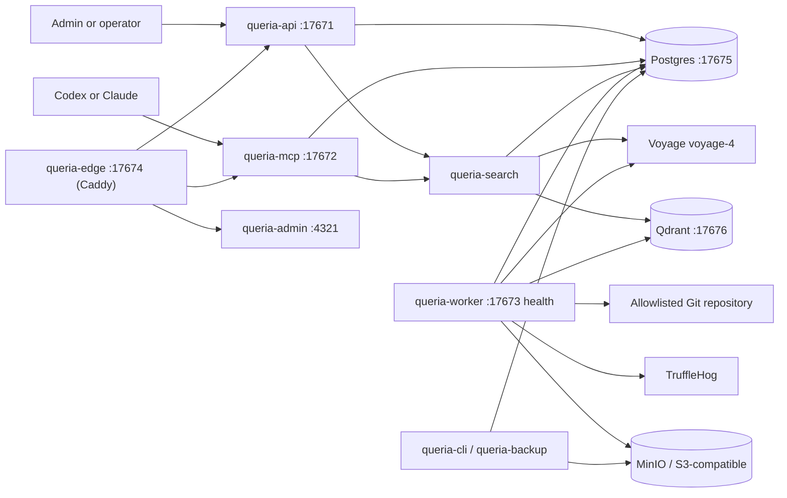

# Queria Backend Handoff

> Last verified: 2026-07-16
> Branch: `main`
> Verified commit: `4e7cb37` (docs: update handoff with dashboard 3d galaxy graph and project modal details)
> Docs pack: post–ponytail-audit living docs (PRODUCT, ARCHITECTURE, SIMPLIFICATION, DOCS_POLICY); historical plans archived.
> SIMPLIFICATION P0 applied: Admin dashboard is stat cards only (Three.js + unused shadcn/React islands removed).
> SIMPLIFICATION P1 applied: Caddy edge (no Pingora/`queria-proxy`); observability folded into core; dead db traits removed.
> SIMPLIFICATION P2–P3 applied: Admin eval UI deferred (CLI kept); `proxy_addr` removed; enowx-rag Qdrant-only.

This is the canonical continuation document for Queria backend work. It
separates implemented behavior from approved target-state design. When other
product docs disagree with this file, prefer this handoff.

Living companion docs: [`PRODUCT.md`](./PRODUCT.md), [`ARCHITECTURE.md`](./ARCHITECTURE.md),
[`SIMPLIFICATION.md`](./SIMPLIFICATION.md), [`DOCS_POLICY.md`](./DOCS_POLICY.md).

## Product Contract

Queria centralizes organization-wide and project-specific knowledge for humans
and AI agents. Every agent should call `retrieve_context(project_id, query)`
before work and may call `propose_memory` after work. Permanent memory enters
normal retrieval only through approval or a trusted Git ingestion pipeline.

Knowledge scopes:

- `global`: reusable coding, security, deployment, SOP, and operational standards.
- `project`: business flow, technical decisions, integrations, incidents, gotchas, and domain notes for one project.
- `include_global=true` still requires token permission; project-only tokens cannot retrieve global knowledge.

## Repository Boundaries

| Path | Git status | Responsibility |
|---|---|---|
| `queria/backend` | Git repository, `main` tracks `origin/main` | Rust backend, migrations, runtime runbooks, HANDOFF + SIMPLIFICATION. |
| `queria` | Not a Git repository | Product overview and local workspace grouping. |
| workspace `docs/` | Not a Git repository | Product REFERENCE research, UI flow, MCP client notes, thin mirrors. |

Do not assume parent-workspace documents are present in a standalone backend
clone. This handoff and [`SIMPLIFICATION.md`](./SIMPLIFICATION.md) contain the
required next-step context for ops acceptance and complexity cuts.

## Implemented Architecture



The Rust workspace uses edition 2024 and contains nine crates:
`queria-core` (auth + observability), `queria-db`, `queria-search`,
`queria-api`, `queria-mcp`, `queria-worker`, `queria-ingestion`,
`queria-cli`, and `queria-backup`. Public edge is Caddy (`docker/Caddyfile`),
not a Rust proxy crate.

## Completion Matrix

### Backend Capability

| Capability | Status | Evidence or gap |
|---|---|---|
| Rust workspace and binaries | `COMPLETED` | API, MCP, worker, and CLI binaries compile in one workspace (edge is Caddy). |
| Runtime config and JSON logging | `COMPLETED` | Environment-driven config and tracing JSON are implemented. |
| Postgres, Qdrant, MinIO local infrastructure | `COMPLETED` | `docker-compose.yml` exposes ports `17675`-`17679`. |
| Baseline schema and migrations | `COMPLETED` | Eight bundled migrations cover baseline, sessions, source indexes, ingestion, hybrid retrieval, retry backoff, evaluation reports, and backup records. |
| First-run setup and local login/session | `COMPLETED` | Setup token, first admin, password hashing, login, cookie session, and `/me` exist. |
| Projects and source registry API | `COMPLETED` | List/create/get project and register/list/get source are DB-backed. |
| Approval flow | `COMPLETED` | List/detail/approve/reject, initial chunk creation, and audit events exist. |
| Git ingestion MVP | `COMPLETED` | Allowlist validation, TruffleHog gate, parser/chunker, stale cleanup, trusted auto-approval, and job lifecycle exist. |
| Voyage-4 and Qdrant clients | `COMPLETED` | Provider clients, collection setup, durable jobs, and backfill are implemented. |
| Hybrid retrieval and RRF | `COMPLETED` | Semantic plus Postgres FTS works with strict-weighted relaxed OR query fallback. |
| Embedding pacing and graceful stop | `COMPLETED` | Paced batches requeue and unlock jobs instead of sleeping while holding a running job. |
| Evaluation baseline | `COMPLETED` (CLI) | Shared executor via `queria-cli eval run`; Admin evaluation HTTP routes removed. |
| MCP HTTP transport | `COMPLETED` | `initialize`, `tools/list`, and `tools/call` work with agent-token authorization. |
| MCP agent tools | `COMPLETED` | Agent surface: `retrieve_context`, `search_knowledge`, `propose_memory`, `list_projects`, `get_source`. Maintainer actions (approve/reject, reindex, token admin) stay on session Admin HTTP API by design, not MCP. |
| Admin-oriented API | `COMPLETED` | Dashboard, audit logs, approvals, jobs, sources, tokens (no evaluations HTTP). |
| Edge reverse proxy | `COMPLETED` | Caddy path router (`docker/Caddyfile`) for `/api/`, `/mcp`, admin, and health on host port `17674`. Pingora/`queria-proxy` removed in P1. |
| Astro Admin UI | `COMPLETED` | Sahara SSR pages; pure Astro (no React islands). SIMPLIFICATION P0 applied 2026-07-16. |
| S3 backup and restore drill | `COMPLETED` (drill deferrable) | `queria-backup` crate + CLI/runbook; live empty-volume restore remains acceptance. Restore-drill module is SIMPLIFICATION P2 defer. |
| Production OCI packaging | `COMPLETED` | Dockerfiles, production Compose, deployment/rollback runbooks. Stack is deployed; Phase 7 acceptance pack still open. |

### Human UI Screens

| Screen / surface | Status | Entry point / honesty note |
|---|---|---|
| Setup Wizard | `COMPLETED` | `/admin/setup` |
| Login / Logout | `COMPLETED` | `/admin/login`, `/admin/logout` |
| Dashboard | `COMPLETED` | `/admin/dashboard` stat cards + embedding bar + latest job/eval panels |
| Projects | `COMPLETED` | `/admin/projects` with create-project dialog |
| Sources | `COMPLETED` | `/admin/sources`, `/admin/sources/detail` (embedding counts on source detail) |
| Knowledge Items | `COMPLETED` | `/admin/knowledge` |
| Approval Queue | `COMPLETED` | `/admin/approvals` |
| Ingestion Jobs | `COMPLETED` | `/admin/jobs` (primary place for job lifecycle; embedding work shows up as jobs) |
| Embedding Status | `EMBEDDED` | No dedicated `/admin/embedding` route. Visible via dashboard summary, source detail chunk-state counts, jobs list, and CLI `embeddings status`. |
| Retrieval Probe | `EMBEDDED` | No dedicated `/admin/retrieval-probe` route. Operator probe/eval path is Evaluation + CLI `retrieval probe`. |
| Agent Tokens | `COMPLETED` | `/admin/tokens` |
| Audit Logs | `COMPLETED` | `/admin/audit` |
| Evaluation | `CLI` | Admin page + evaluation HTTP removed. Run `queria-cli eval run --project <slug>`; dashboard may show last report if present |
| Backup/Restore | `API/CLI` | No dedicated Admin UI page. Backup/restore is CLI + `queria-backup` + runbook. |

## Production Host

| Field | Value |
|---|---|
| Public IP | `168.110.214.130` |
| SSH user | `ubuntu` |
| Hostname | `instance-20260518-2039` (Oracle Cloud aarch64) |
| OS | Ubuntu 24.04 (kernel `6.17.0-1016-oracle`) |
| Deploy path | `/home/ubuntu/queria-backend` |
| Compose file | `docker-compose.production.yml` (also legacy copy under `/home/ubuntu/queria`) |
| Local SSH private key | workspace root `ssh-key-2026-04-16.key` (mode `600`; never commit) |
| Local SSH public key | workspace root `ssh-key-2026-04-16.key.pub` |

Connect:

```bash
ssh -i /Users/fernandojulian/project/knowledge-based-rag/ssh-key-2026-04-16.key ubuntu@168.110.214.130
```

Verified live stack on 2026-07-16 (containers up ~7 days):

| Service | Notes |
|---|---|
| `queria-edge` (Caddy) | Public host port `17674` (path router; replace after redeploy) |
| `queria-backend-queria-api-1` | Internal only |
| `queria-backend-queria-mcp-1` | Internal only |
| `queria-backend-queria-worker-1` | Internal only |
| `queria-backend-queria-admin-1` | Internal (`4321` in container) |
| `queria-backend-postgres-1` | Healthy |
| `queria-backend-qdrant-1` | Healthy |
| `queria-backend-minio-1` | Running |

Proxy health on the host:

```bash
curl -sS http://127.0.0.1:17674/healthz   # OK / HTTP 200
```

Host resource snapshot (2026-07-16): ~11 GiB RAM, ~188G disk with ~145G free, Docker 29.5.0.

Same host also runs unrelated shared workloads (monitoring, other app DBs, `grok2api`, etc.). Do not treat the box as Queria-only when planning ports, disk, or restarts.

Security:

- Never paste the RSA private key into git, chat history, or docs beyond the local path above.
- Workspace `.gitignore` already ignores `*.key`.
- Prefer Infisical for app secrets; host `.env` files are emergency/runtime only.

## Current Local State

The first project is `fjulian-me`, sourced from:

```text
/Users/fernandojulian/project/fjulian/fjulian.me
```

Embedding snapshot observed on 2026-07-05:

| State | Count |
|---|---:|
| `ready` | 344 |
| `pending` | 717 |
| `failed` | 168 |
| `processing` | 0 |
| `stale` | 0 |

The latest `embedding_backfill` job is `queued`, attempt `12`, with no worker
lock. Historical failed chunks remain retryable.

`README.md` specifically has 10 ready, 12 pending, and 2 failed chunks. The
`README.md: Deployment` chunk is pending, while other build/deployment chunks
are already ready.

## Latest Verified Retrieval Finding

Historical gap (pre-Phase-1): the golden query `deployment and site build notes`
failed under strict-only `websearch_to_tsquery('simple', $query)` because
`simple` kept `and` and AND-combined every term.

**Resolved in code:** hybrid lexical SQL now uses strict-weighted matches plus a
bounded relaxed OR path; RRF still combines lexical and semantic rankings.
Auth, approved status, active source, organization, project, and global-scope
filters remain inside both SQL paths.

Re-verify on current production data after embedding backfill; do not treat the
old 2/3 failure as the live default without a fresh probe.

## Latest Evaluation Result

Historical local observation (2026-07-05, pre-shared executor and pre-relaxed
lexical path):

Command:

```bash
rtk infisical run --env=dev -- cargo run -p queria-cli -- eval run --project fjulian-me
```

Observed then:

- total: 3
- passed: 2
- failed: 1
- regression score: `0.77777773`
- failed question: `deployment and site build notes`

**Code status since then:** CLI and HTTP share `EvaluationExecutor` and both
persist reports. Fresh production acceptance must re-run eval and record the
new score here; do not close Phase 7 on this historical 2/3 result alone.

## Operational Commands

Start infrastructure:

```bash
rtk docker compose up -d postgres qdrant minio
```

Run migrations:

```bash
rtk infisical run --env=dev -- cargo run -p queria-cli -- database migrate
```

Run a bounded worker pass:

```bash
rtk infisical run --env=dev -- /usr/bin/env \
  QUERIA_EMBEDDING_BATCH_SIZE=8 \
  QUERIA_EMBEDDING_REQUEST_INTERVAL_MS=30000 \
  cargo run -p queria-worker
```

Check embedding state:

```bash
rtk infisical run --env=dev -- cargo run -p queria-cli -- embeddings status --project fjulian-me
```

Run quality gates:

```bash
rtk cargo fmt --all --check
rtk cargo test --workspace
rtk cargo clippy --workspace --all-targets --all-features -- -D warnings
rtk git diff --check
```

## Security Boundaries

- Never commit provider keys, Cloudflare credentials, setup tokens, sessions, or agent tokens.
- Infisical is the primary runtime secret source; `.env` remains local fallback only.
- Raw agent tokens are shown once; Postgres stores token prefix and hash.
- Project Git paths and SSH repositories must pass explicit allowlists.
- TruffleHog must pass before trusted Git auto-approval.
- Agent proposals never receive trusted Git auto-approval.
- Global retrieval requires both `include_global=true` and token permission.
- Database writes, migrations, dependency additions, pushes, and deployments require explicit approval.

## Residual Gaps (current)

| Gap | Priority | Notes |
|---|---|---|
| Embedding backfill residual | High | Last local snapshot (2026-07-05) had many pending/failed chunks. Re-measure on production and finish bounded backfill. |
| Production acceptance pack | High | Stack is live; DoD (eval 3/3, MCP client accept, backup restore, SLO spot-check, handoff close) still open. |
| Hard simplification cuts | Done (P0–P3) | See [`SIMPLIFICATION.md`](./SIMPLIFICATION.md) progress log. Ops acceptance pack still open. |
| Admin UI dedicated routes | Low | Embedding / retrieval probe / backup are embedded or CLI-only (see screen matrix). Optional polish only. |
| Maintainer MCP tools | Deferred by design | Approve/reject/reindex/token admin remain Admin HTTP; agent MCP stays five tools. |

## Post-audit simplification

Ponytail-audit (over-engineering) findings are tracked in
[`SIMPLIFICATION.md`](./SIMPLIFICATION.md). Hard mode agreed cuts:

| Band | Intent | Status |
|---|---|---|
| P0 | Drop dead shadcn kit + Three.js dashboard graph | **DONE** 2026-07-16 |
| P1 | Replace Pingora with Caddy; fold observability; prune dead db traits | **DONE** 2026-07-16 |
| P2 | Defer evaluation Admin UI + HTTP; restore-drill CLI-only; drop `proxy_addr` | **DONE** 2026-07-16 |
| P3 | enowx-rag Qdrant-only; remove Chroma/pgvector/OpenAI stubs | **DONE** 2026-07-16 |
| Closeouts | mockall demotion, runbook sync, leftover trait/cfg work | **DONE** 2026-07-16 |
| Impact | Fold auth into core; demote search mockall to dev-deps via hand fakes | **DONE** 2026-07-16 |

Do not treat archived e2e plans under [`archive/superpowers/`](./archive/superpowers/)
as the active roadmap.

## Continue From Here

Feature scaffolding for Phases 1–6 is done. Immediate work:

**Ops acceptance**

1. Measure embedding status on production; classify and retry failed chunks.
2. Re-run golden evaluation (CLI); record score here.
3. Production acceptance pack (health, login, probe, MCP, scopes, backup/restore).
4. Record deploy commit/image, endpoints, eval score, and open issues in this handoff.

**Post-cut**

5. SIMPLIFICATION P0–P3 applied 2026-07-16; redeploy with Caddy edge (`queria-edge`) when shipping to production host.
6. Keep maintainer tools off the agent MCP surface unless product requires otherwise.

