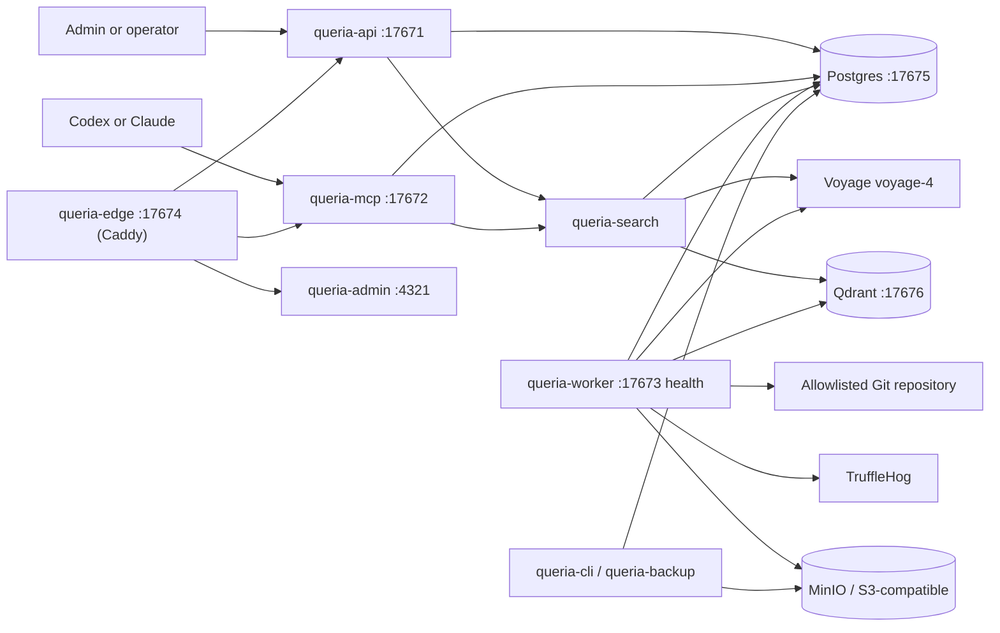

# Queria Backend Handoff

> Last verified: 2026-07-18 (local main: retrieval quality + Admin Playground; prod image still dual-lane Slice A — see stack identity)
> Branch: `main`
> Deployed image commit: `c1cdfd70caf65a4bf020fbb921c60f515c277788` (dual-lane Slice A). Image bake-in for TruffleHog config is on `main` at `37e7b7c` — **not yet redeployed** to the live host image. Rerank/compress/Playground are on local `main` and **not** claimed as live on the production host until redeploy.
> Docs pack: post–ponytail-audit living docs (PRODUCT, ARCHITECTURE, SIMPLIFICATION, DOCS_POLICY); historical plans archived.
> SIMPLIFICATION P0 applied: Admin dashboard is stat cards only (Three.js + unused shadcn/React islands removed).
> SIMPLIFICATION P1 applied: Caddy edge (no Pingora/`queria-proxy`); observability folded into core; dead db traits removed.
> SIMPLIFICATION P2–P3 applied: Admin eval UI deferred (CLI kept); `proxy_addr` removed; enowx-rag Qdrant-only.
> **Production now runs Caddy `queria-edge` + dual-lane image** (redeploy 2026-07-17; see stack identity below).
> **Production project `fjulian-me` seeded**; embedding backfill **substantially complete** (ready 1226 / failed 3 Voyage 429 residual).

This is the canonical continuation document for Queria backend work. It
separates implemented behavior from approved target-state design. When other
product docs disagree with this file, prefer this handoff.

Living companion docs: [`PRODUCT.md`](./PRODUCT.md), [`ARCHITECTURE.md`](./ARCHITECTURE.md),
[`SIMPLIFICATION.md`](./SIMPLIFICATION.md), [`IMPROVEMENTS.md`](./IMPROVEMENTS.md),
[`DOCS_POLICY.md`](./DOCS_POLICY.md).

## Product Contract

Queria centralizes organization-wide and project-specific knowledge for humans
and AI agents. Full contract: [`PRODUCT.md`](./PRODUCT.md).

**Implemented today:** agents call `retrieve_context` before work and may call
`propose_memory` after work. Permanent **trusted** memory enters normal retrieval
only through approval or a trusted Git ingestion pipeline.

**Dual-lane Slice A (code + prod image 2026-07-17):** project-scoped **scratch**
via MCP `index_memory` (permission `IndexMemory`), sync Voyage+Qdrant embed,
content_hash idempotency, shared max body with `propose_memory`, and
`include_scratch` default true on agent retrieve. Promote / Admin scratch UI
still deferred (`IMP-15`/`IMP-16`). See PRODUCT lanes and
[`IMPROVEMENTS.md`](./IMPROVEMENTS.md).

**Retrieval quality + Playground (local main 2026-07-18):** shared pipeline
pool → RRF → hydrate → Voyage rerank (`rerank-2.5`, **fail-open**) → near-dup
compress (prefer trusted); optional `rerank`/`compress` on API/MCP/CLI; state-held
`PgRetrievalService` on API/MCP; Admin SSR `/admin/playground`. Env knobs
`QUERIA_RERANK_*`, `QUERIA_COMPRESS_ENABLED` (defaults on). Diagnostics:
`rerank_applied`, `compress_dropped`, `latency_ms`. Backlog IDs IMP-01/02/03
(and pool sizing IMP-17 folded in). **Not** production-redeployed with this handoff.

Knowledge scopes:

- `global`: reusable coding, security, deployment, SOP standards (**trusted only**; no scratch global).
- `project`: project trusted knowledge plus that project’s scratch when `include_scratch` is true.
- `include_global=true` still requires token permission; project-only tokens cannot retrieve global knowledge.
- `include_scratch`: default true for agent retrieve; false/trusted-only for golden eval path.

## Repository Boundaries

| Path | Git status | Responsibility |
|---|---|---|
| `queria/backend` | Git repository, `main` tracks `origin/main` | Rust backend, migrations, runtime runbooks, HANDOFF + SIMPLIFICATION. |
| `queria` | Not a Git repository | Product overview and local workspace grouping. |
| workspace `docs/` | Not a Git repository | Product REFERENCE research, UI flow, MCP client notes, thin mirrors. |

Do not assume parent-workspace documents are present in a standalone backend
clone. This handoff and [`SIMPLIFICATION.md`](./SIMPLIFICATION.md) contain the
required next-step context for ops acceptance and complexity cuts.

## Implemented Architecture



The Rust workspace uses edition 2024 and contains nine crates:
`queria-core` (auth + observability), `queria-db`, `queria-search`,
`queria-api`, `queria-mcp`, `queria-worker`, `queria-ingestion`,
`queria-cli`, and `queria-backup`. Public edge is Caddy (`docker/Caddyfile`),
not a Rust proxy crate.

## Completion Matrix

### Backend Capability

| Capability | Status | Evidence or gap |
|---|---|---|
| Rust workspace and binaries | `COMPLETED` | API, MCP, worker, and CLI binaries compile in one workspace (edge is Caddy). |
| Runtime config and JSON logging | `COMPLETED` | Environment-driven config and tracing JSON are implemented. |
| Postgres, Qdrant, MinIO local infrastructure | `COMPLETED` | `docker-compose.yml` exposes ports `17675`-`17679`. |
| Baseline schema and migrations | `COMPLETED` | Eight bundled migrations cover baseline, sessions, source indexes, ingestion, hybrid retrieval, retry backoff, evaluation reports, and backup records. |
| First-run setup and local login/session | `COMPLETED` | Setup token, first admin, password hashing, login, cookie session, and `/me` exist. |
| Projects and source registry API | `COMPLETED` | List/create/get project and register/list/get source are DB-backed. |
| Approval flow | `COMPLETED` | List/detail/approve/reject, initial chunk creation, and audit events exist. |
| Git ingestion MVP | `COMPLETED` | Allowlist validation, TruffleHog gate, parser/chunker, stale cleanup, trusted auto-approval, and job lifecycle exist. |
| Voyage-4 and Qdrant clients | `COMPLETED` | Provider clients, collection setup, durable jobs, and backfill are implemented. |
| Hybrid retrieval and RRF | `COMPLETED` | Semantic plus Postgres FTS works with strict-weighted relaxed OR query fallback. |
| Rerank + compress pipeline | `COMPLETED` (local main 2026-07-18) | Pool RRF → hydrate → Voyage rerank fail-open → near-dup compress (prefer trusted). Flags + diagnostics on all surfaces. Runbook: [`runbooks/hybrid-retrieval.md`](./runbooks/hybrid-retrieval.md). Prod image may lag until redeploy. |
| Admin retrieval Playground | `COMPLETED` (local main 2026-07-18) | `/admin/playground` SSR form + results; not Evaluation Admin product. |
| Embedding pacing and graceful stop | `COMPLETED` | Paced batches requeue and unlock jobs instead of sleeping while holding a running job. |
| Evaluation baseline | `COMPLETED` (CLI) | Shared executor via `queria-cli eval run`; Admin evaluation HTTP routes removed. |
| MCP HTTP transport | `COMPLETED` | `initialize`, `tools/list`, and `tools/call` work with agent-token authorization. |
| MCP agent tools | `COMPLETED` | Agent surface: `retrieve_context`, `search_knowledge`, `propose_memory`, `list_projects`, `get_source`, `index_memory` (scratch). Optional `rerank`/`compress` on retrieve/search. Maintainer actions stay on session Admin HTTP, not MCP. |
| Admin-oriented API | `COMPLETED` | Dashboard, audit logs, approvals, jobs, sources, tokens (no evaluations HTTP). |
| Edge reverse proxy | `COMPLETED` | Caddy path router (`docker/Caddyfile`) for `/api/`, `/mcp`, admin, and health on host port `17674`. Pingora/`queria-proxy` removed in P1. |
| Astro Admin UI | `COMPLETED` | Sahara SSR pages; pure Astro (no React islands). SIMPLIFICATION P0 applied 2026-07-16. |
| S3 backup and restore drill | `COMPLETED` | Backup in `queria-backup`; restore-drill lives only in `queria-cli` (removed from lib). Live empty-volume restore remains acceptance. |
| Production OCI packaging | `COMPLETED` | Dockerfiles, production Compose, deployment/rollback runbooks. Stack is deployed; Phase 7 acceptance pack still open. |

### Human UI Screens

| Screen / surface | Status | Entry point / honesty note |
|---|---|---|
| Setup Wizard | `COMPLETED` | `/admin/setup` |
| Login / Logout | `COMPLETED` | `/admin/login`, `/admin/logout` |
| Dashboard | `COMPLETED` | `/admin/dashboard` stat cards + embedding bar + latest job/eval panels |
| Projects | `COMPLETED` | `/admin/projects` with create-project dialog |
| Sources | `COMPLETED` | `/admin/sources`, `/admin/sources/detail` (embedding counts on source detail) |
| Knowledge Items | `COMPLETED` | `/admin/knowledge` |
| Approval Queue | `COMPLETED` | `/admin/approvals` |
| Ingestion Jobs | `COMPLETED` | `/admin/jobs` (primary place for job lifecycle; embedding work shows up as jobs) |
| Embedding Status | `EMBEDDED` | No dedicated `/admin/embedding` route. Visible via dashboard summary, source detail chunk-state counts, jobs list, and CLI `embeddings status`. |
| Retrieval Probe / Playground | `COMPLETED` | Dedicated lean SSR `/admin/playground` (nav: Playground). Session probe reuses `POST /api/v1/projects/{slug}/retrieval/probe` with rerank/compress toggles, scores, lane, diagnostics. Eval remains CLI only. CLI `retrieval probe` flags still available. |
| Agent Tokens | `COMPLETED` | `/admin/tokens` |
| Audit Logs | `COMPLETED` | `/admin/audit` |
| Evaluation | `CLI` | Admin page + evaluation HTTP removed. Run `queria-cli eval run --project <slug>`; dashboard may show last report if present |
| Backup/Restore | `API/CLI` | No dedicated Admin UI page. Backup/restore is CLI + `queria-backup` + runbook. |

## Production Host

| Field | Value |
|---|---|
| Public IP | `168.110.214.130` |
| SSH user | `ubuntu` |
| Hostname | `instance-20260518-2039` (Oracle Cloud aarch64) |
| OS | Ubuntu 24.04 (kernel `6.17.0-1016-oracle`) |
| Deploy path | `/home/ubuntu/queria-backend` |
| Compose file | `docker-compose.production.yml` (also legacy copy under `/home/ubuntu/queria`) |
| Local SSH private key | workspace root `ssh-key-2026-04-16.key` (mode `600`; never commit) |
| Local SSH public key | workspace root `ssh-key-2026-04-16.key.pub` |

Connect:

```bash
ssh -i /Users/fernandojulian/project/knowledge-based-rag/ssh-key-2026-04-16.key ubuntu@168.110.214.130
```

### Stack identity (redeployed 2026-07-17, dual-lane + Caddy)

| Field | Value |
|---|---|
| Host deploy path | `/home/ubuntu/queria-backend` |
| Host git checkout | still older tree files may lag; **runtime image** is authoritative |
| Runtime `QUERIA_SOURCE_COMMIT` | `c1cdfd70caf65a4bf020fbb921c60f515c277788` |
| Image | `queria-backend:latest` / tag `queria-backend:c1cdfd70caf65a4bf020fbb921c60f515c277788` (`sha256:dcad68efb5d9…`, created 2026-07-17T10:14Z) |
| Edge service (live) | `queria-backend-queria-edge-1` image `caddy:2.10-alpine` (Caddy **v2.10.2**), host `17674` |
| Legacy proxy | **removed** (no `queria-proxy` container after redeploy) |
| API / MCP / worker / admin | Up on dual-lane image (recreated on redeploy) |
| Postgres / Qdrant | **healthy**; volumes **not wiped** (`queria-backend_postgres_data` / `queria-backend_qdrant_data` created 2026-07-08) |
| MinIO | `Up` (volume preserved) |
| Schema | `_queria_migration` through `20260717000200` (10 rows). Includes dual-lane: `knowledge_status` enum has **`scratch`**. |
| Env alignment | compose `env_file: .env` + overrides; `QDRANT_API_KEY` length matches host and qdrant service key; `VOYAGE_API_KEY` and `QUERIA_FIRST_ADMIN_EMAIL` present in API container |
| Org | `fjulian` (1 user/admin; setup already consumed 2026-07-08) |
| Projects | **1** — slug `fjulian-me` (seeded 2026-07-17; see seed pack below) |

Verified live stack after redeploy (2026-07-17):

| Service | Notes |
|---|---|
| `queria-backend-queria-edge-1` | Public host port `17674` (Caddy; Server header `Caddy`) |
| `queria-backend-queria-api-1` | Image dual-lane; `/usr/local/bin/queria-cli` present |
| `queria-backend-queria-mcp-1` | Dual-lane image |
| `queria-backend-queria-worker-1` | Dual-lane image |
| `queria-backend-queria-admin-1` | Internal (`4321`) |
| `queria-backend-postgres-1` | Healthy; volume preserved |
| `queria-backend-qdrant-1` | Healthy; volume preserved |
| `queria-backend-minio-1` | Running |

Edge health after redeploy + explicit migrate:

```bash
curl -sS -o /tmp/healthz.out -w "%{http_code}" http://127.0.0.1:17674/healthz
# http_code=200 body=OK  (Server: Caddy)
docker compose -f docker-compose.production.yml run --rm --no-deps queria-api queria-cli database migrate
# {"status":"migrated"}  (idempotent; migrations already included dual-lane)
```

**Note:** runbook `deployment.md` historically used `queria-api database migrate` without the `queria-cli` binary name; production entrypoint requires `queria-cli database migrate`.

Host resource snapshot: ~11 GiB RAM, ~188G disk with ~144G free, Docker on OCI aarch64.

Same host also runs unrelated shared workloads (monitoring, other app DBs, `grok2api`, etc.). Do not treat the box as Queria-only when planning ports, disk, or restarts.

### Mission ops acceptance pack (2026-07-17, measure-only — historical)

Earlier same day, before seed: project missing; status/probe/eval all exited 1 with `admin or project not found`. See git history of this section if needed. **Superseded by seed pack below.**

### Mission ops seed pack (2026-07-17, `ops-prod-seed-fjulian-me`)

**Allowed for this feature:** create project `fjulian-me`, register Git source `git@github.com:nandocoeg2/fjulian.me.git`, ingestion + embedding backfill, then status/probe/**one** eval + HANDOFF.  
**Not done:** full image rebuild/redeploy, volume wipe, second eval run, dual-lane `index_memory` on prod.

| Check | Result |
|---|---|
| Edge healthz | **HTTP 200**, body `OK` (Caddy) |
| Project | slug **`fjulian-me`** exists (org `fjulian`, project id `9e5d90ee-c782-457e-98b1-86ff85cffb6a`) |
| Git source | `git@github.com:nandocoeg2/fjulian.me.git` active; local checkout `/tmp/seed10001/fjulian.me` (allowlist host `github.com`, repo `nandocoeg2/fjulian.me.git`) |
| Git ingest | job `a8e589f9-…` **succeeded**: 231 files, **1213** knowledge items, **1229** chunks (all initially pending) |
| TruffleHog fix | image lacked `config/trufflehog-*.txt`; worker bind-mount `./config:/config:ro` + absolute env paths; first fail was missing include paths (not real secrets) |
| Embedding backfill | job `6528e606-…` enqueued; Voyage **429** rate limits with batch 8 / 2s interval; ready increased 0 → **72** during seed session |
| Embeddings status | **exit 0** JSON (see residual below) |
| Retrieval probe | **exit 0**; structured `items` (5) + `retrieval.mode` hybrid for both golden-ish queries |
| Golden eval (once) | **3/3 passed**, regression **1.0**, report id `6c8b5df9-89e4-45c1-8fda-e76b5a4ec567` persisted |

**Production embeddings residual for `fjulian-me` (2026-07-17 seed session, post-probe/eval):**

```json
{
  "project": "fjulian-me",
  "project_exists": true,
  "embedding_profile_version": "voyage-4-1024-v1",
  "counts": {
    "ready": 72,
    "pending": 1005,
    "failed": 152,
    "processing": 0,
    "stale": 0
  },
  "knowledge_items_approved": 1213,
  "chunks_total": 1229,
  "ingest_job": "succeeded",
  "backfill_job_status": "queued (retrying; Voyage 429 residual)",
  "cli_exit": 0
}
```

**Probe notes (seed session):**

- Query `deployment and site build notes` → 5 items, `retrieval.mode=hybrid`, first path `src/entry-server.tsx`, status/lane `approved`/`trusted`.
- Query `Astro markdown content flow` → 5 items, hybrid, citation paths present.
- Read-ish after seed writes; no second backfill enqueue for probes.

**Eval (exactly one run this seed session):**

| Field | Value |
|---|---|
| Project | `fjulian-me` |
| Report id | `6c8b5df9-89e4-45c1-8fda-e76b5a4ec567` |
| Status | `passed` |
| Total / passed / failed | **3 / 3 / 0** |
| Regression score | **1.0** |
| Failing questions | **none** |
| Modes observed | hybrid + lexical_fallback mix (semantic partial while embeddings residual) |
| Mission note | Single prod eval only; Phase 7 golden **3/3 met** on content criteria |

### Mission ops backfill restatus (2026-07-17, `ops-prod-embedding-backfill-restatus`)

**Allowed:** poll embeddings status, optional probe, HANDOFF residual; worker continues pacing.  
**Not done:** volume wipe, backfill re-enqueue, second eval, deploy/restart/migrate.

| Check | Result |
|---|---|
| Edge healthz | **HTTP 200**, body `OK` (Caddy) |
| Containers | api/mcp/worker/edge/admin/postgres/qdrant/minio **Up** (same dual-lane image) |
| Embeddings status | **exit 0** (JSON below) |
| Progress vs seed | ready **72 → 1226**; pending **1005 → 0**; failed **152 → 3** |
| Backfill job `6528e606-…` | **succeeded** (attempts ~55; Voyage 429 retries with batch 8 / ~2s interval) |
| Retrieval probe (optional) | **exit 0**; hybrid 5 hits for `deployment and site build notes` (README scripts/Docker deploy paths; semantic candidates 20) |
| Second eval | **skipped** (default; counts improved substantially but prior golden 3/3 and no user-facing regression suspected) |
| Volume wipe | **none** |

**Production embeddings residual for `fjulian-me` (2026-07-17 restatus, final poll ~13:08 UTC):**

```json
{
  "project": "fjulian-me",
  "project_exists": true,
  "embedding_profile_version": "voyage-4-1024-v1",
  "counts": {
    "ready": 1226,
    "pending": 0,
    "failed": 3,
    "processing": 0,
    "stale": 0
  },
  "chunks_total": 1229,
  "knowledge_items_approved": 1213,
  "backfill_job_status": "succeeded",
  "failed_error_class": "Voyage 429 Too Many Requests (all 3 residual)",
  "failed_sample_titles": [
    "src/utils/siteOutput.ts: StaticFileOutput",
    ".agents/skills/vercel-react-best-practices/rules/js-index-maps.md: Build Index Maps for Repeated Lookups",
    ".agents/skills/code-review/references/language/rust.md: `unsafe`"
  ],
  "worker_pacing": {
    "QUERIA_EMBEDDING_BATCH_SIZE": 8,
    "QUERIA_EMBEDDING_REQUEST_INTERVAL_MS": 2000,
    "QUERIA_EMBEDDING_MAX_RETRIES": 3
  },
  "poll_timeline_ready": [1104, 1152, 1200, 1224, 1226],
  "cli_exit": 0
}
```

**Probe notes (restatus):** query `deployment and site build notes` → 5 items, `retrieval.mode=hybrid`, `semantic_candidates=20`, top paths `README.md` (Scripts / Docker / Portainer deploy). Read-ish only.

**Ops open issues (after restatus):**

1. ~~Prod has no projects/knowledge~~ **Resolved** (`fjulian-me`, 1213 items / 1229 chunks).
2. ~~Embedding residual still large~~ **Mostly resolved** — ready **1226** / pending **0** / failed **3** (Voyage 429). No wipe; optional later bounded retry of the 3 failed if quota allows (not required for golden DoD).
3. ~~**TruffleHog config not in runtime image**~~ **Committed on `main` (`37e7b7c`)** — Dockerfile `COPY config/trufflehog-*.txt` + absolute `QUERIA_TRUFFLEHOG_*` env; production compose reasserts paths. **Live image still `c1cdfd7` until next redeploy** (seed used host `/config` bind-mount).
4. **Inactive Mac path source** remains deactivated; only GitHub SSH source is active.
5. ~~Runtime edge `queria-proxy`~~ **Resolved** (Caddy).
6. Optional: bake worker pacing (`QUERIA_EMBEDDING_BATCH_SIZE=8`, interval ≥2s) into permanent prod `.env` to reduce 429 churn on future large ingests.

Security:

- Never paste the RSA private key into git, chat history, or docs beyond the local path above.
- Workspace `.gitignore` already ignores `*.key`.
- Prefer Infisical for app secrets; host `.env` files are emergency/runtime only.

## Current Local State

The first project is `fjulian-me`, sourced from:

```text
/Users/fernandojulian/project/fjulian/fjulian.me
```

**Historical local** embedding snapshot observed on 2026-07-05 (not production):

| State | Count |
|---|---:|
| `ready` | 344 |
| `pending` | 717 |
| `failed` | 168 |
| `processing` | 0 |
| `stale` | 0 |

The latest `embedding_backfill` job is `queued`, attempt `12`, with no worker
lock. Historical failed chunks remain retryable.

`README.md` specifically has 10 ready, 12 pending, and 2 failed chunks. The
`README.md: Deployment` chunk is pending, while other build/deployment chunks
are already ready.

**Production (2026-07-17 restatus):** project `fjulian-me` present; embeddings ready **1226** / pending **0** / failed **3** (backfill job succeeded; see Mission ops backfill restatus).

## Latest Verified Retrieval Finding

Historical gap (pre-Phase-1): the golden query `deployment and site build notes`
failed under strict-only `websearch_to_tsquery('simple', $query)` because
`simple` kept `and` and AND-combined every term.

**Resolved in code:** hybrid lexical SQL now uses strict-weighted matches plus a
bounded relaxed OR path; RRF still combines lexical and semantic rankings.
Auth, approved status, active source, organization, project, and global-scope
filters remain inside both SQL paths.

**Production re-verify (2026-07-17 seed + restatus):** probe for `deployment and site build notes`
returns structured hybrid hits (5 items) with semantic candidates populated after
backfill completion (ready 1226). Golden eval remains 3/3 from the single seed run.

## Latest Evaluation Result

### Production seed acceptance (2026-07-17) — one allowed run

Command (on prod host; host `.env` + golden file from deploy tree):

```bash
docker run --rm --network container:queria-backend-queria-api-1 \
  --env-file /home/ubuntu/queria-backend/.env \
  -v /home/ubuntu/queria-backend/tests:/workdir/tests:ro \
  -w /workdir --entrypoint /usr/local/bin/queria-cli \
  queria-backend:latest eval run --project fjulian-me
```

Observed:

- CLI exit: **0**
- Report id: `6c8b5df9-89e4-45c1-8fda-e76b5a4ec567`
- total: **3** / passed: **3** / failed: **0**
- regression score: **1.0**
- status: **passed**
- `evaluation_report` insert: **yes** (1 row)
- **Not** a second run for score shopping. Phase 7 golden content DoD **met**.

### Historical measure-only (2026-07-17 earlier, pre-seed)

- Exit 1 `admin or project not found`; no report. Superseded by seed run above.

### Historical local only (2026-07-05)

Command:

```bash
rtk infisical run --env=dev -- cargo run -p queria-cli -- eval run --project fjulian-me
```

Observed then:

- total: 3
- passed: 2
- failed: 1
- regression score: `0.77777773`
- failed question: `deployment and site build notes`

**Code status since then:** CLI and HTTP share `EvaluationExecutor` and both
persist reports. Do **not** close Phase 7 on the historical local 2/3 result alone.
Production re-measure (above) did not produce a content score either.

## Operational Commands

Start infrastructure:

```bash
rtk docker compose up -d postgres qdrant minio
```

Run migrations:

```bash
rtk infisical run --env=dev -- cargo run -p queria-cli -- database migrate
```

Run a bounded worker pass:

```bash
rtk infisical run --env=dev -- /usr/bin/env \
  QUERIA_EMBEDDING_BATCH_SIZE=8 \
  QUERIA_EMBEDDING_REQUEST_INTERVAL_MS=30000 \
  cargo run -p queria-worker
```

Check embedding state:

```bash
rtk infisical run --env=dev -- cargo run -p queria-cli -- embeddings status --project fjulian-me
```

Run quality gates:

```bash
rtk cargo fmt --all --check
rtk cargo test --workspace
rtk cargo clippy --workspace --all-targets --all-features -- -D warnings
rtk git diff --check
```

## Security Boundaries

- Never commit provider keys, Cloudflare credentials, setup tokens, sessions, or agent tokens.
- Infisical is the primary runtime secret source; `.env` remains local fallback only.
- Raw agent tokens are shown once; Postgres stores token prefix and hash.
- Project Git paths and SSH repositories must pass explicit allowlists.
- TruffleHog must pass before trusted Git auto-approval.
- Agent proposals never receive trusted Git auto-approval.
- Global retrieval requires both `include_global=true` and token permission.
- Database writes, migrations, dependency additions, pushes, and deployments require explicit approval.

## Residual Gaps (current)

| Gap | Priority | Notes |
|---|---|---|
| Production empty seed | **Resolved** | `fjulian-me` seeded 2026-07-17; 1213 items / 1229 chunks; golden eval **3/3**. |
| Production embeddings residual | **Low** | Restatus 2026-07-17: ready **1226** / pending **0** / failed **3** (all Voyage 429). Backfill job **succeeded**. Optional later retry of 3 failed only if needed; no wipe. |
| Production acceptance pack | Medium | Healthz, stack identity, embeddings status, probe, **eval 3/3** recorded. Remaining Phase 7: MCP client smoke, backup restore drill, SLO spot-check. |
| Edge still `queria-proxy` | **Resolved** | Live edge is Caddy `queria-edge` after 2026-07-17 redeploy. |
| Prod container env drift | Medium | CLI still prefers host `--env-file` for some flags; compose `env_file` mostly aligned post-redeploy. |
| TruffleHog config in image | **Low** (code done) | **Committed** `37e7b7c` on `main` (Dockerfile COPY + env). Live prod image still dual-lane `c1cdfd7` until redeploy; seed used host `/config` bind-mount. |
| Hard simplification cuts | Done (P0–P3) | See [`SIMPLIFICATION.md`](./SIMPLIFICATION.md). |
| Admin UI dedicated routes | Low | Embedding / backup remain embedded or CLI-only. Playground route shipped for retrieval probe. |
| Maintainer MCP tools | Deferred by design | Approve/reject/reindex/token admin remain Admin HTTP; agent MCP does not expose maintainer mutations. |
| Production redeploy for retrieval quality | Medium | Local main has rerank/compress/Playground; live host image still dual-lane Slice A (`c1cdfd7`). Redeploy only when operator requests (out of this docs feature). |
| Future product improvements | REFERENCE backlog | IMP-01/02/03 done on local main. Still open: IMP-04 metrics, IMP-15/16 Admin scratch/promote, agent DX. [`IMPROVEMENTS.md`](./IMPROVEMENTS.md) / [`PRODUCT.md`](./PRODUCT.md). |

## Post-audit simplification

Ponytail-audit (over-engineering) findings are tracked in
[`SIMPLIFICATION.md`](./SIMPLIFICATION.md). Hard mode agreed cuts:

| Band | Intent | Status |
|---|---|---|
| P0 | Drop dead shadcn kit + Three.js dashboard graph | **DONE** 2026-07-16 |
| P1 | Replace Pingora with Caddy; fold observability; prune dead db traits | **DONE** 2026-07-16 |
| P2 | Defer evaluation Admin UI + HTTP; restore-drill CLI-only; drop `proxy_addr` | **DONE** 2026-07-16 |
| P3 | enowx-rag Qdrant-only; remove Chroma/pgvector/OpenAI stubs | **DONE** 2026-07-16 |
| Closeouts | mockall demotion, runbook sync, leftover trait/cfg work | **DONE** 2026-07-16 |
| Impact | Fold auth into core; demote search mockall to dev-deps via hand fakes | **DONE** 2026-07-16 |
| Deep cuts | Kill mockall; nest AppConfig; split repositories; move restore_drill to CLI | **DONE** 2026-07-16 |

Do not treat archived e2e plans under [`archive/superpowers/`](./archive/superpowers/)
as the active roadmap.

## Continue From Here

Feature scaffolding for Phases 1–6 is done. Immediate work:

**Ops acceptance (status after 2026-07-17 seed + restatus)**

1. ~~Measure edge health + stack identity~~ **done** (healthz 200; Caddy edge; dual-lane image).
2. ~~Create project / Git ingest / one eval~~ **done** (`fjulian-me`, eval 3/3).
3. ~~Embedding backfill restatus~~ **done** (ready 1226 / failed 3; job succeeded; HANDOFF residual updated).
4. Remaining acceptance: MCP client smoke, scopes, backup restore drill, SLO spot-check (still open).
5. Optional ops: bake embedding pacing into prod `.env`; **redeploy** so live image picks up TruffleHog path-filter bake-in (`37e7b7c`).

**Post-cut**

6. SIMPLIFICATION P0–P3 applied 2026-07-16; prod redeployed to Caddy + dual-lane image 2026-07-17.
7. Keep maintainer tools off the agent MCP surface unless product requires otherwise.

**Product improvements**

8. Retrieval quality IMP-01/02 + Admin Playground IMP-03 shipped on **local main** (2026-07-18); docs/runbook aligned. Next backlog: durable metrics (`IMP-04`), Admin scratch/promote (`IMP-15`/`16`), agent DX. Contract: [`PRODUCT.md`](./PRODUCT.md). Do not mark done without updating this handoff.

