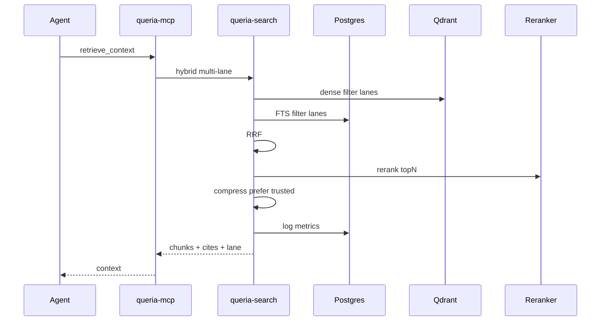
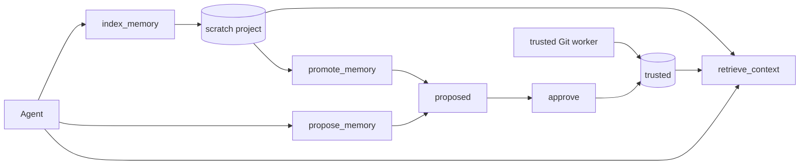

# Queria Improvement Backlog (enowx-informed)

> Status: REFERENCE — approved direction and ranked backlog, not an implementation ledger.
> Last verified: 2026-07-19.
> Runtime truth: [`HANDOFF.md`](./HANDOFF.md).
> Product contract: [`PRODUCT.md`](./PRODUCT.md) (includes dual-lane trust model).
> What not to re-add: [`SIMPLIFICATION.md`](./SIMPLIFICATION.md).
> Architecture: [`ARCHITECTURE.md`](./ARCHITECTURE.md).

If this file and HANDOFF disagree about what ships today, **HANDOFF wins**.
Items below stay `proposed` until code lands and HANDOFF records them as implemented.

## Why this exists

Sibling project **enowx-rag** is a local/personal per-project RAG MCP with strong
retrieval knobs (rerank, compression, playground, metrics), agent install DX, and
**direct agent write** to memory.

**Queria** is a centralized team knowledge hub with auth, approval, Git
ingestion, and audit.

Approved product direction: keep Queria’s trusted hub, and **add a project-scoped
scratch lane** so agents can index/read personal memory immediately (enowx DX)
without writing into trusted/global team truth. Details in [`PRODUCT.md`](./PRODUCT.md).

Also adopt enowx lessons for **retrieval quality** and **install DX**, without
copying multi-store or a full enowx SPA/binary product shape.

## Comparison snapshot

| Axis | enowx-rag | Queria (today) | Queria (target dual-lane) |
|---|---|---|---|
| Goal | Per-project agent memory | Org + project shared knowledge | Same + per-project scratch |
| Trust | Agent indexes freely | Propose / Git / approve only | Scratch direct; trusted still gated |
| Stack | Go single binary + embedded React | Rust multi-service + Astro Admin + Caddy | Unchanged |
| Search | Hybrid + rerank + compression | Hybrid RRF + Voyage rerank + near-dup compress | Lane-aware rank; optional further knobs |
| Metrics | SQLite query metrics | JSON logs | Durable Postgres metrics (IMP-04) |
| Probe | Playground UI | Admin SSR Playground + CLI probe / eval | Lean page (not eval product) |
| Install DX | Skill, multi-client, stdio + HTTP | Central HTTP MCP | + skill, snippets, stdio adapter |

## Out of scope / anti-goals

Do **not** treat these as Queria defaults:

| Idea | Why skip |
|---|---|
| Multi vector-store (Chroma/pgvector) | SIMPLIFICATION P3; Postgres SoT + Qdrant |
| Agent direct write into **trusted** or **global** | Dual-lane: only **scratch**, project-scoped |
| Full flip: drop approval for all memory | Team truth stays gated |
| Full Playground + Settings SPA | Admin stays lean Astro; secrets via env/Infisical |
| Reintroducing Pingora / Three.js / eval Admin product | Completed SIMPLIFICATION cuts |
| One-binary OSS install as product core | Multi-service team infra |

## Status legend (items)

| Status | Meaning |
|---|---|
| `proposed` | Approved in this backlog; not implemented |
| `in_progress` | Active implementation (also note in HANDOFF) |
| `done` | Shipped; HANDOFF is source of truth for behavior |
| `deferred` | Explicitly postponed by product |

## Recommended execution order

```text
Ops residual (HANDOFF) in parallel

Dual-lane core:
  IMP-13 (schema + index_memory) → IMP-14 (retrieve lanes) → IMP-15 (Admin scratch)

Retrieval quality (after schema stable):
  IMP-01 (+ recall/k = IMP-17) + IMP-02 (+ char budget = IMP-18)
  → IMP-19 filters/lean cites → IMP-04 + IMP-03
  → IMP-20 only if Voyage query path proven needed

Write quality (with dual-lane writes):
  IMP-22 content_hash + IMP-23 max-size (no full secret scanner)
  → IMP-21 deferred (freeform tags first)

Agent DX:
  IMP-05 + IMP-08 (static skill/snippets; no docs HTTP API)
  → IMP-06 + IMP-07 → IMP-16 → IMP-26 ownership only (quota later)
  → IMP-25 = extend existing health only

Defer / yagni until proven:
  IMP-24, IMP-27, full IMP-21 taxonomy, write quotas in IMP-26
```

Parallel residual from HANDOFF (not replaced by this list):

1. Embedding backfill hygiene  
2. Production acceptance pack  
3. Further simplification only if needed  

## Target retrieval path (dual-lane + quality)





---

## Backlog

### P0 — Retrieval quality and operator trust

#### IMP-01 — Reranker after hybrid RRF

| Field | Value |
|---|---|
| Priority | P0 |
| Status | `done` (2026-07-18) |
| Problem | Hybrid RRF ranks semantic + lexical; precision can still be noisy for global+project mixes. |
| enowx reference | Voyage `rerank-2.5` wired into `core.Service.Search` after candidate retrieval. |
| Proposed approach | Pluggable reranker interface in `queria-search` (default Voyage rerank). Apply after RRF on a bounded candidate pool; clamp topK server-side. Gate with config/env; fail open or fail closed documented in runbook. |
| Surfaces | `queria-search`, `queria-mcp`, `queria-api` retrieval, config, hybrid-retrieval runbook |
| Acceptance | `retrieve_context` / search path can enable rerank; topK clamped; unit/integration test with fake reranker; golden eval not regressed on fixed fixture; config documented. |
| Dependencies | Voyage (or chosen) API key; latency budget noted in metrics (IMP-04). |
| Shipped notes | Concrete Voyage client (`POST /v1/rerank`, model `rerank-2.5`); env `QUERIA_RERANK_*`; request optional `rerank`; **fail-open** only; pool → RRF → hydrate → rerank; no multi-provider trait. See HANDOFF retrieval quality. |

#### IMP-02 — Near-duplicate compression

| Field | Value |
|---|---|
| Priority | P0 |
| Status | `done` (2026-07-18) |
| Problem | Overlapping global/project/source chunks waste agent context tokens. |
| enowx reference | Near-duplicate compression on ranked results. |
| Proposed approach | Post-rank compress: similarity threshold on text or embedding of returned hits; keep highest-ranked of near-dups; expose optional flag default-on for `retrieve_context`. |
| Surfaces | `queria-search`, MCP/API retrieval response |
| Acceptance | Duplicate-heavy fixture returns fewer near-identical snippets while preserving diversity of distinct facts; tests for threshold edge cases. |
| Dependencies | Best after or with IMP-01 (compress after final rank order). |
| Shipped notes | Pure near-dup on normalized body and/or content hash after rerank; prefer trusted over scratch; env `QUERIA_COMPRESS_ENABLED`; request optional `compress`; `compress_dropped` diagnostic. Char budget packaging (IMP-18) still open if needed later. |

#### IMP-03 — Embedded Admin retrieval probe

| Field | Value |
|---|---|
| Priority | P0 |
| Status | `done` (2026-07-18) |
| Problem | Operators rely on CLI for live retrieval trust; no lean Admin surface. |
| enowx reference | Playground (query, scores, snippets). |
| Proposed approach | **Embedded** probe (not a product eval UI, not a full SPA playground): small form on Knowledge or Jobs — query, project, include_global — returns top chunks, scores, latency. Session-admin only. Reuse existing retrieval API. |
| Surfaces | Admin Astro, `queria-api` (if thin probe endpoint needed) |
| Acceptance | Admin user can probe without CLI; no dedicated eval product page; Playwright/smoke if Admin tests exist; PRODUCT still says eval is CLI. |
| Dependencies | Prefer IMP-04 for latency display; after dual-lane, probe should show lane labels; SIMPLIFICATION: not re-adding Evaluation Admin product. |
| Shipped notes | Lean SSR page `/admin/playground` (nav item Playground); form includes include_scratch, limit, rerank, compress; reuses `POST .../retrieval/probe`; diagnostics strip with `latency_ms` / `rerank_applied` / `compress_dropped` (no durable metrics table). Eval remains CLI. |

#### IMP-04 — Durable query metrics

| Field | Value |
|---|---|
| Priority | P0 |
| Status | `proposed` |
| Problem | Query health is only in JSON logs; hard to see p50/p95 and hit rates over time. |
| enowx reference | SQLite durable query metrics (latency, breakdown). |
| Proposed approach | Postgres table (or append-only metrics rows): timestamp, project_id, source (mcp/api/cli), latency_ms, hit_count, include_global, include_scratch, optional model/rerank flags. Dashboard summary cards only (counts + recent latency). Retention policy aligned with audit (e.g. 30 days hot). |
| Surfaces | migration, `queria-search`/`api`/`mcp`, Admin dashboard summary, maybe CLI rollup later |
| Acceptance | Successful retrieval writes a metrics row; dashboard shows last-N or aggregate without heavy chart framework; migration reversible story documented. |
| Dependencies | Keep lean Admin (no Three.js). |

### P1 — Agent DX and adoption

#### IMP-05 — Skill + AGENTS / CLAUDE merge templates

| Field | Value |
|---|---|
| Priority | P1 |
| Status | `proposed` |
| Problem | Agents do not reliably call retrieve/propose unless project docs instruct them. |
| enowx reference | skill guide + idempotent AGENTS.md merge + Path A/B onboarding. |
| Proposed approach | Official Queria skill markdown + templates for `AGENTS.md` / `CLAUDE.md`: before-work `retrieve_context`; after-work prefer `index_memory` for session/project scratch and `propose_memory` when promoting team truth; project_id/slug mapping. Merge append rules (do not clobber existing project files). |
| Surfaces | docs/skill under backend or workspace REFERENCE; maybe CLI `queria-cli setup project` later |
| Acceptance | Template + skill committed; documented install path for Claude/Codex/Factory; merge is idempotent on second run. |
| Dependencies | Stable tool names (IMP-07 may add tools; templates list shipped tools only). |

#### IMP-06 — MCP stdio local adapter

| Field | Value |
|---|---|
| Priority | P1 |
| Status | `proposed` |
| Problem | Central MCP is HTTP-first; many local clients prefer stdio. |
| enowx reference | Default MCP stdio + remote HTTP daemon. |
| Proposed approach | Thin local adapter (or documented `mcp-remote`/client config) that bridges stdio to edge `/mcp` with bearer agent token. First-class install snippets (IMP-08). |
| Surfaces | small binary or client config docs; MCP client REFERENCE docs |
| Acceptance | Documented path for at least Claude and Codex; no second source of truth for tools (still hits central MCP). |
| Dependencies | Stable edge auth; IMP-08 for copy-paste. |

#### IMP-07 — Extra read-only MCP tools

| Field | Value |
|---|---|
| Priority | P1 |
| Status | `proposed` |
| Problem | Product README listed more discovery tools; agent surface is five tools only. |
| enowx reference | list/inspect/manage memory tools (manage does not apply to Queria writes). |
| Proposed approach | Add **read-only** tools already sketched in product docs: `list_sources`, `describe_project`, `get_memory_status`. Permission-gated. **Never** approve/reject/reindex/token admin on MCP. |
| Surfaces | `queria-mcp` tools + handlers, auth permissions, PRODUCT/HANDOFF tool lists |
| Acceptance | tools/list exposes them only with permission; HANDOFF matrix updated; no maintainer mutations on MCP. |
| Dependencies | Existing DB repos for projects/sources/jobs status. |

#### IMP-08 — Admin client install snippets

| Field | Value |
|---|---|
| Priority | P1 |
| Status | `proposed` |
| Problem | Token page exists; multi-client MCP config is tribal knowledge. |
| enowx reference | Docs page with copy-paste agent prompts and client configs. |
| Proposed approach | On Tokens or a thin Docs section: snippets for Claude, Codex, Cursor (and Factory if used) with edge base URL placeholder + token. No embedding of live secrets into docs generation beyond one-time token display (already pattern). |
| Surfaces | Admin Astro Tokens/Docs |
| Acceptance | Operator can copy a working JSON/TOML fragment; README runbook links to same examples. |
| Dependencies | Public/edge base URL known; IMP-06 notes for stdio vs HTTP. |

### P2 — Knobs, portability, ops polish

#### IMP-09 — Per-query safe search options

| Field | Value |
|---|---|
| Priority | P2 |
| Status | `proposed` |
| Problem | Limited control on hybrid/limit behavior per call beyond basic limit. |
| enowx reference | SearchOpts (hybrid, rerank, compress toggles). |
| Proposed approach | Safe options: limit clamp, hybrid on/off, min_score, optional rerank/compress flags — all server-side clamped and permission-agnostic bounds. |
| Surfaces | MCP tool schemas, API retrieval, search lib |
| Acceptance | Invalid/out-of-range values rejected or clamped with tests; defaults match current product behavior. |
| Dependencies | IMP-01/02 for option wiring. |

#### IMP-10 — Embedding profiles + versioned re-embed

| Field | Value |
|---|---|
| Priority | P2 |
| Status | `proposed` |
| Problem | Voyage-first is correct; TEI/self-host and clean re-embed path still design-only. |
| enowx reference | OpenAI-compatible/TEI embedders + migration re-embed UI/engine. |
| Proposed approach | Keep Voyage default. Document/implement embedding profile config (managed vs TEI). Versioned collection or named-vector migration with dual-write/backfill jobs; **no** Chroma/pgvector multi-store. Operator path via CLI + job status, not enowx Migration SPA clone. |
| Surfaces | worker, search clients, config, embeddings CLI, HANDOFF |
| Acceptance | Profile cannot mix dims in one active collection; backfill job updates version metadata; runbook for model change. |
| Dependencies | Embedding backfill residual (HANDOFF) first. |

#### IMP-11 — Lightweight job activity refresh

| Field | Value |
|---|---|
| Priority | P2 |
| Status | `proposed` |
| Problem | Admin Jobs is poll-only; long ingests feel stale. |
| enowx reference | SSE event stream refreshing dashboard stats. |
| Proposed approach | Short-poll or minimal SSE for job list/status only (admin session). No full product event bus. |
| Surfaces | Admin Jobs, optional small API stream |
| Acceptance | Running job appears updated without full page reload; load stays bounded. |
| Dependencies | Admin lean constraint. |

#### IMP-12 — Embedding status / reindex-backfill clarity

| Field | Value |
|---|---|
| Priority | P2 |
| Status | `proposed` |
| Problem | Embedding status is embedded across dashboard/source/jobs/CLI; operators relearn where to look. |
| enowx reference | Migration page + Overview metrics. |
| Proposed approach | Tighten existing surfaces: source detail counts + one dashboard embedding bar + explicit “retry backfill” path already in jobs/CLI; document single operator path in runbook. Avoid new Migration SPA. |
| Surfaces | Admin Sources/Dashboard/Jobs, runbooks, CLI embeddings |
| Acceptance | Runbook lists one primary path; HANDOFF embedding residual measurable from that path. |
| Dependencies | HANDOFF production embedding re-measure. |

### Dual-lane agent memory (approved product direction)

Contract: [`PRODUCT.md`](./PRODUCT.md) knowledge lanes.
**Slice A shipped (code + prod image dual-lane base):** IMP-13 + IMP-14 (schema, `IndexMemory`, `index_memory`, content_hash, max body, `include_scratch` default true). Runtime truth: [`HANDOFF.md`](./HANDOFF.md).
**Retrieval quality shipped (2026-07-18 local main):** IMP-01 rerank, IMP-02 compress, IMP-03 Admin Playground (recall/pool sizing folded into pipeline with IMP-01). Runtime truth: [`HANDOFF.md`](./HANDOFF.md).
**Still proposed:** IMP-15 Admin scratch, IMP-16 promote, IMP-04 durable metrics, optional packaging IMP-18 char budget.

#### IMP-13 — Schema + `index_memory` (scratch write)

| Field | Value |
|---|---|
| Priority | P0 (product) |
| Status | `done` (2026-07-17 Slice A) |
| Problem | Agents cannot persist searchable per-project memory without waiting for approval; forces either blocking humans or abusing proposed queue. |
| enowx reference | `rag_index` / direct chunk write into project collection. |
| Proposed approach | Add trust lane / status `scratch` (or equivalent) on knowledge items/chunks; Qdrant payload `trust_lane`; MCP tool `index_memory` (project_id, title/body/tags); embed + upsert immediately; permission `index_memory`; **reject** global scope and trusted overwrite. Audit actor + project. Optional `expires_at` default policy. |
| Surfaces | migrations, `queria-db`, `queria-search`/worker embed path, `queria-mcp`, auth permissions, PRODUCT/HANDOFF |
| Acceptance | Agent with permission can write scratch for project A and retrieve it; cannot write global; cannot mutate approved trusted; no permission ⇒ tool hidden/denied; audit row exists. |
| Dependencies | None beyond current embed pipeline; do before relying on IMP-14 defaults. |
| Shipped notes | Migrations `20260717000100` / `20260717000200`; MCP `index_memory` + permission `IndexMemory`; sync embed path; content_hash idempotency; shared max body with `propose_memory`. |

#### IMP-14 — Dual-lane retrieval

| Field | Value |
|---|---|
| Priority | P0 (product) |
| Status | `done` (2026-07-17 Slice A) |
| Problem | After scratch exists, retrieval must include it without leaking across projects or into global, and without treating it as eval “truth”. |
| enowx reference | Per-project collection isolation (Queria uses filters + lanes instead of only separate products). |
| Proposed approach | `retrieve_context` / `search_knowledge`: default `include_scratch=true` for agents; always project-filter scratch; global path trusted-only; return lane (or status) on citations; near-dup compress **prefer trusted** (IMP-02). Operator/API may pass `include_scratch=false` for trusted-only probe. |
| Surfaces | `queria-search`, MCP/API schemas, hybrid SQL + Qdrant filters, eval filters |
| Acceptance | Scratch from project A never appears under project B; global query never returns scratch; default agent retrieve merges trusted+scratch; golden eval fixtures use trusted-only; tests cover permission + include flags. |
| Dependencies | IMP-13 schema/write path. |
| Shipped notes | `include_scratch` default true on agent retrieve; CLI/eval trusted-only (`include_scratch=false`); hybrid filters + status/lane on hits. Near-dup prefer-trusted delivered with IMP-02. |

#### IMP-15 — Admin scratch surface (list / delete / TTL)

| Field | Value |
|---|---|
| Priority | P1 |
| Status | `proposed` |
| Problem | Operators need visibility and cleanup of agent-written scratch without promoting it to official knowledge lists by accident. |
| enowx reference | Chunks browser / manage memory tools (admin side only for Queria). |
| Proposed approach | Lean Admin list: filter knowledge by lane=scratch; delete/expire; show agent token prefix / time. No full Migration SPA. Optional TTL job for expired scratch. |
| Surfaces | Admin Astro, Admin API, optional worker expiry job |
| Acceptance | Operator can list and delete scratch for a project; approved knowledge UI remains distinct; session auth only. |
| Dependencies | IMP-13. |

#### IMP-16 — `promote_memory` (scratch → proposed)

| Field | Value |
|---|---|
| Priority | P1 |
| Status | `proposed` |
| Problem | Good scratch facts should enter team trust without retyping; still must not skip approval. |
| enowx reference | N/A (enowx has no trusted lane). |
| Proposed approach | MCP or Admin action `promote_memory`: copy/move scratch item into `proposed` approval queue; never auto-approve. Permission-gated. |
| Surfaces | `queria-mcp` and/or Admin, approvals flow |
| Acceptance | Promote creates proposed item linked to source scratch; appears in approval queue; trusted only after approve; cannot promote to global without existing global-propose rules (default: project only). |
| Dependencies | IMP-13; existing approval pipeline. |

### Retrieval packaging and filters

> YAGNI pass 2026-07-17: fold knobs into IMP-01/02 where possible; no tokenizer product, no multi-section docs API, no taxonomy engine until proven.

#### IMP-17 — Two-stage recall then final K

| Field | Value |
|---|---|
| Priority | P1 (implement **inside IMP-01**, not a separate epic) |
| Status | `done` (2026-07-18; folded into pipeline with IMP-01) |
| yagni | Without rerank, fetch-N/take-K is ~10 LOC. Do not ship recall/k as Admin UI or day-one MCP knobs. |
| Problem | Before rerank, candidate pool must be larger than the final answer set. |
| enowx reference | `Recall` then `K` around rerank. |
| Proposed approach | Fixed server defaults when wiring IMP-01 (e.g. recall=40, k=5). Clamp only. Expose via MCP later only if IMP-09 needs it. |
| Surfaces | `queria-search` (same PR as IMP-01) |
| Acceptance | candidates ≥ k; response length ≤ k. No new Admin UI. |
| Dependencies | IMP-01. |
| Shipped notes | Pool = `min(limit * candidate_multiplier, candidate_cap)`; RRF over pool then rerank top_k=`limit`. Not exposed as separate MCP knobs. |

#### IMP-18 — Soft size budget on `retrieve_context`

| Field | Value |
|---|---|
| Priority | P1 (fold with IMP-02) |
| Status | `proposed` |
| yagni | No tokenizer crate, no `budget_used` metrics product, no per-query budget API. |
| Problem | Long chunks × many hits blow agent context. |
| enowx reference | Compress + small default K. |
| Proposed approach | After compress: stop appending when total **char** length exceeds one env constant. Prefer drop scratch over trusted if dual-lane. Optional single `truncated: true` bool. |
| Surfaces | `queria-search` pack step |
| Acceptance | Long-chunk fixture under cap; unit test. |
| Dependencies | IMP-02; IMP-14 for prefer-trusted drop. |

#### IMP-19 — Hard status filters + lean citations

| Field | Value |
|---|---|
| Priority | P0 for **filters**; citations stay lean |
| Status | `proposed` |
| yagni | No type/category/embed_model zoo on every hit. No “show deprecated” override until an operator asks twice. |
| Problem | Agents must not get rejected/deprecated/draft as context; need minimal trust signal. |
| enowx reference | Filterable status; score+snippet. |
| Proposed approach | (1) Default agent retrieve: approved/trusted (+ scratch when dual-lane) — exclude deprecated/superseded/rejected/draft. (2) Citation v1: `id`, snippet, score, `source_id`/path, `status` or `lane` when dual-lane ships. Stop there. |
| Surfaces | hybrid filters + MCP response |
| Acceptance | Forbidden statuses never returned by default; tests; citation JSON stays small. |
| Dependencies | IMP-14 for lane label only. |

#### IMP-20 — Query vs document embedding path

| Field | Value |
|---|---|
| Priority | P2 |
| Status | `deferred` |
| yagni | No `QueryEmbedder` trait, no TEI branch. One `if query` in Voyage client when proven. |
| Problem | Some APIs want different query vs document encoding. |
| enowx reference | Multi-provider QueryEmbedder (overbuilt for single Voyage path). |
| Proposed approach | When golden eval or Voyage model requires it: set request input_type in existing client. One unit test. |
| Surfaces | `queria-search` Voyage client only |
| Acceptance | Document path unchanged; query path uses query encoding when enabled. |
| Dependencies | Prove need first. |

### Write quality (scratch + propose)

#### IMP-21 — Typed memory taxonomy

| Field | Value |
|---|---|
| Priority | P2 |
| Status | `deferred` |
| yagni | `propose_memory` already has freeform category/tags. Controlled vocabulary + Admin forms is speculative. Use skill guidance (IMP-05) first. |
| Problem | (Speculative) Unstructured dumps hard to filter. |
| enowx reference | Skill-level type tags — guidance, not schema product. |
| Proposed approach | **No code** until operators filter by type regularly. Then optional allowlist string, not a taxonomy engine. |
| Surfaces | none until un-deferred |
| Acceptance | n/a while deferred |
| Dependencies | Real tag usage. |

#### IMP-22 — Idempotent upsert via `content_hash`

| Field | Value |
|---|---|
| Priority | P1 |
| Status | `proposed` |
| yagni | No version chains / dual-write policy. One key: `(project_id, lane, content_hash)` → no-op or touch `updated_at`. |
| Problem | Repeated same-body `index_memory` multiplies junk. |
| enowx reference | content_hash; Queria Git ingest already hashes. |
| Proposed approach | Normalize body → hash → if active row exists for project/lane, no-op. Reuse existing hash helpers if any. |
| Surfaces | MCP write, DB constraint |
| Acceptance | Double same body → one item; test. |
| Dependencies | IMP-13. |

#### IMP-23 — Write size limits (minimal validation)

| Field | Value |
|---|---|
| Priority | P1 |
| Status | `proposed` |
| yagni | No on-MCP TruffleHog, no growing secret-regex catalog, no async deep scan. Git already has TruffleHog. |
| Problem | Megabyte dumps on scratch/propose. |
| enowx reference | N/A |
| Proposed approach | One `max_body_bytes` env. Clear 400. Unit test. Optional 5-line reject for private-key markers only if free. |
| Surfaces | MCP handlers |
| Acceptance | Oversize rejected; normal notes OK. |
| Dependencies | IMP-13 for scratch; apply to `propose_memory` same day. |

### Agent and install DX (extended)

#### IMP-24 — Agent-readable docs API + bootstrap prompt

| Field | Value |
|---|---|
| Priority | — |
| Status | `deferred` (treat as near-delete from active backlog) |
| yagni | Multi-section `GET /api/docs` clones enowx and duplicates IMP-05 skill + IMP-08 snippets + PRODUCT.md. |
| Problem | Setup contract hard to find (solved by static skill/snippets). |
| enowx reference | Docs HTTP API — product shape we skip. |
| Proposed approach | Bootstrap prompt text lives in **IMP-05/IMP-08 only**. Do not implement docs endpoints. |
| Surfaces | skill/templates only |
| Acceptance | IMP-05 covers retrieve / index_memory / propose dual-lane text. |
| Dependencies | IMP-05, IMP-08. |

#### IMP-25 — Setup / dependency probe

| Field | Value |
|---|---|
| Priority | P2 |
| Status | `proposed` (minimal) |
| yagni | No fourth probe surface. Extend existing health/setup only. |
| Problem | Ops cannot tell if Qdrant/Postgres/Voyage is down. |
| enowx reference | Setup probes; we already have health paths. |
| Proposed approach | Structured OK/fail on existing health (or one CLI print). Skip new MCP tool unless IMP-07 already needs status. Skip “project has chunks?” until asked twice. |
| Surfaces | existing health/setup |
| Acceptance | Down dependency visible without panic. |
| Dependencies | Existing endpoints. |

#### IMP-26 — Scratch ownership (quota deferred)

| Field | Value |
|---|---|
| Priority | P1 for **ownership**; quota later if abuse |
| Status | `proposed` |
| yagni | No writes/day counters, no 429 product until multi-agent abuse shows. |
| Problem | Cross-agent delete/clobber. |
| enowx reference | N/A |
| Proposed approach | `created_by_token_id` on scratch; agent mutates own only; Admin deletes any (IMP-15). Soft max_items = optional constant later next to IMP-23, not a metrics table. |
| Surfaces | MCP write/delete, DB, IMP-15 |
| Acceptance | Token B cannot delete token A scratch; Admin can. |
| Dependencies | IMP-13, IMP-15. |

### Indexing quality (extend Git / embed)

#### IMP-27 — `embedding_context` prepend

| Field | Value |
|---|---|
| Priority | P2 |
| Status | `deferred` |
| yagni | Dual embed/display strings + prefix versioning + re-embed-on-change couples to IMP-10. No proof short chunks need NL prefixes more than filters/rerank. |
| Problem | (Speculative) short chunks lack context for embed. |
| enowx reference | Metadata-rich index (not this exact feature). |
| Proposed approach | If un-deferred after eval plateau: one short prefix format, worker only, no Admin UI. |
| Surfaces | worker embed only |
| Acceptance | n/a while deferred |
| Dependencies | IMP-01/02/14 first; eval proof. |

### Local multi-git `index-here` (hybrid; self-hosted friendly)

Design (REFERENCE): [`archive/superpowers/specs/2026-07-19-local-git-index-here-design.md`](./archive/superpowers/specs/2026-07-19-local-git-index-here-design.md).

Not cloud clone of unreachable remotes. CLI on the machine that has the git checkouts; multi-root discover; quality gates; **quarantine** then **promote** (Admin UI + privileged MCP). Does **not** default-agent-write into trusted.

#### IMP-L1 — CLI `index-here` multi-git discover + client gates

| Field | Value |
|---|---|
| Priority | P1 |
| Status | `proposed` |
| Problem | Users must not fill Git allowlist/source forms; workspaces have many nested git roots; self-hosted remotes unreachable from OCI worker. |
| Proposed approach | `queria index-here --token-env QUERIA_AGENT_TOKEN`: depth-limited discover of git roots under cwd; `git ls-files`; extension/path/size/secret gates; dry-run. |
| Surfaces | `queria-cli` |
| Acceptance | Nested multi-repo workspace lists N roots; non-git dirs skipped; dry-run no upload. |
| Dependencies | Design spec above. |

#### IMP-L2 — API + storage quarantine + embed

| Field | Value |
|---|---|
| Priority | P1 |
| Status | `proposed` |
| Problem | Need central place for bulk local index that is not auto-trusted. |
| Proposed approach | Agent-auth batch ingest; re-validate gates server-side; chunk+embed; lane/status **quarantine**; idempotent content_hash. |
| Surfaces | `queria-api`, `queria-db`, `queria-search` / embed path |
| Acceptance | Upload creates quarantine only; default retrieve does not hit it. |
| Dependencies | IMP-L1 client shape. |

#### IMP-L3 — Retrieve `include_quarantine` authz

| Field | Value |
|---|---|
| Priority | P1 |
| Status | `proposed` |
| Problem | Owners/Admin may need to review quarantine in probe; default agents must not drown in unreviewed dumps. |
| Proposed approach | Flag default false; allow owner token subject and Admin session. |
| Surfaces | retrieval MCP/API/CLI |
| Acceptance | Default retrieve = trusted (+ scratch rules unchanged); quarantine only when allowed. |
| Dependencies | IMP-L2. |

#### IMP-L4 — Admin promote / reject UI

| Field | Value |
|---|---|
| Priority | P1 |
| Status | `proposed` |
| Problem | Shared trusted must not absorb garbage; human promote one-click. |
| Proposed approach | Admin list quarantine by origin/commit/path; Promote → trusted; Reject; audit. |
| Surfaces | Admin SSR |
| Acceptance | Promote makes probe trusted-hit; reject removes from quarantine queue. |
| Dependencies | IMP-L2. |

#### IMP-L5 — MCP promote tools (privileged)

| Field | Value |
|---|---|
| Priority | P1 |
| Status | `proposed` |
| Problem | Privileged operators want promote without browser. |
| Proposed approach | Tools `list_quarantine` / `promote_*` / `reject_*`; **not** default agent mint; grant explicit. |
| Surfaces | `queria-mcp` |
| Acceptance | Token without grant 403; with grant can promote to trusted. |
| Dependencies | IMP-L2, IMP-L4 semantics. |

#### IMP-L6 — Optional auto-promote scores (default off)

| Field | Value |
|---|---|
| Priority | P2 |
| Status | `proposed` |
| yagni until P1 quarantine UX ships | Hard-score auto trusted (e.g. docs-only paths) only after promote UX proven. |
| Dependencies | IMP-L2–L4. |

---

## SIMPLIFICATION non-goals check

This backlog **must not** reverse completed cuts:

- Pingora / `queria-proxy` (edge is Caddy)
- Three.js / shadcn Admin graph kit
- Evaluation as first-class Admin product (CLI remains eval path)
- Multi-store backends for enowx or Queria beyond Qdrant (+ Postgres SoT)
- Maintainer tools on agent MCP by default (privileged promote for IMP-L5 is explicit grant only)
- Agent writes into **trusted/global** by default (dual-lane scratch; bulk local git → **quarantine** then promote, not silent trusted)
- Tokenizer/budget product, multi-section docs HTTP API, taxonomy engine, QueryEmbedder abstraction, embedding_context dual-store (YAGNI 2026-07-17 on IMP-17–27)

If a future item conflicts, update PRODUCT boundaries first, then this file.

## How status advances

When implementing an item:

1. Code + tests  
2. Runbook if ops-facing  
3. Update [`HANDOFF.md`](./HANDOFF.md) completion matrix / residual gaps  
4. Set item status here to `done` (date) or `in_progress`  
5. Do **not** claim runtime completion only in this file  

Update checklist also lives in [`DOCS_POLICY.md`](./DOCS_POLICY.md).
