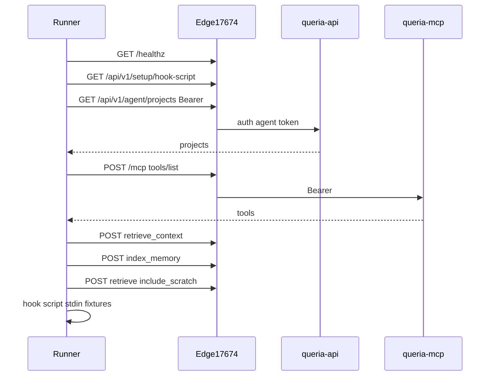

# Design: Full agent-path E2E against production edge

> Status: REFERENCE  
> Last verified: 2026-07-19  
> Product contract: [`../../PRODUCT.md`](../../PRODUCT.md)  
> Runtime truth: [`../../HANDOFF.md`](../../HANDOFF.md)  
> Related hooks design: [`2026-07-19-agent-auto-retrieve-hooks-design.md`](./2026-07-19-agent-auto-retrieve-hooks-design.md)  
> Related dual-lane probe: [`../../../../scripts/mission_dl_pending_e2e.py`](../../../../scripts/mission_dl_pending_e2e.py)

## Problem

Queria now has agent surfaces on production (MCP + agent-bearer HTTP + hook setup snippets), but there is no single automated proof that the **full agent path** works end-to-end on the live edge:

```text
token available → list projects → retrieve → index_memory → re-retrieve scratch
→ agent HTTP retrieve → hook script fail-open / inject
```

Existing pieces are partial:

| Asset | Covers | Gap |
|---|---|---|
| `cargo test -p queria-api` isolation / unit | Local code paths | No live edge |
| `scripts/mission_dl_pending_e2e.py` | MCP dual-lane against local MCP URL | Token fixture local; no hooks / agent HTTP routes |
| `scripts/smoke-hybrid-retrieval.sh` | CLI probe + golden eval | Session/CLI, not agent token path |
| Admin Playwright | Login/setup markup smoke | Not agent path |

## Locked decisions

| Knob | Choice |
|---|---|
| Scope | **Full agent path** only: token → MCP list/retrieve/index → hooks inject |
| Environment | **Production edge** primary: `http://168.110.214.130:17674` |
| Suite shape | **Hybrid (C)**: default pre-minted smoke token/project; optional `--mint` with admin session secrets |
| Write safety | Scratch only, unique markers, dedicated project |
| Not in v1 suite | Git ingest, embeddings backfill, golden hit-rate gates, multi-org, backup restore, Admin Playwright deep flows, real Droid/Claude GUI session |

## Goals

1. One operator/CI command proves agent path on live edge without code deployment.
2. Failures are actionable (which step ID failed: E0…E15).
3. No secrets in git; raw token never printed.
4. Scratch writes are isolated and identifiable for cleanup.

## Non-goals

- Full product path (Admin UI create project → Git ingest → embed → eval thresholds).
- Load testing or SLO latency budgets as hard gates (may log latency only).
- Proving Claude/Droid process actually fires hooks (only the **hook script + setup API**).
- Replacing unit/integration tests.

## Architecture

```text
Runner (laptop/CI)
  env: QUERIA_EDGE_URL, QUERIA_AGENT_TOKEN
       optional: QUERIA_SMOKE_ADMIN_EMAIL, QUERIA_SMOKE_ADMIN_PASSWORD
  →
  scripts/e2e_agent_path_edge.(sh|py)
  →
  Edge :17674 (Caddy)
    /healthz
    /api/v1/setup/*          (public)
    /api/v1/agent/*          (Bearer agent)
    /api/v1/agent-tokens     (session; --mint only)
    /api/v1/auth/*           (session; --mint only)
    /mcp                     (Bearer agent)
```



## Prod fixtures (operator, once)

Create and keep outside git:

| Fixture | Rule |
|---|---|
| Project slug | Prefer `queria-smoke` (or fixed existing slug documented in runbook). Token must include this slug only (or only smoke + known test slugs). |
| Trusted knowledge | Optional: one small approved note so retrieve is non-empty. Empty `items` is allowed if structure assertions pass; document expected emptiness. |
| Agent token | Tools at least: `list_projects`, `retrieve_context`, `search_knowledge`, `index_memory`. Optional `propose_memory` not required for v1 hard path. |
| Token secrets | Store in password manager / CI secret. Rotate on leak. |
| Optional mint user | Smoke admin with membership in same org; password as CI secret. Never production owner password in CI if avoidable. |

Environment variables:

```bash
export QUERIA_EDGE_URL='http://168.110.214.130:17674'
export QUERIA_AGENT_TOKEN='qria_…'          # required for default mode
# Optional mint mode:
export QUERIA_SMOKE_ADMIN_EMAIL='…'
export QUERIA_SMOKE_ADMIN_PASSWORD='…'
export QUERIA_SMOKE_PROJECT_SLUG='queria-smoke'
```

Optional knobs:

```bash
export QUERIA_E2E_MARKER_PREFIX='e2e-agent'
export QUERIA_E2E_RETRIEVE_RETRIES=5
export QUERIA_E2E_RETRIEVE_SLEEP_SEC=2
export QUERIA_E2E_SKIP_HOOKS=0
```

## Suite entrypoint

**Primary deliverable path (implementation later):**

```text
queria/backend/scripts/e2e_agent_path_edge.py
# or bash thin wrapper calling python
```

Preference: **Python** extending patterns from `mission_dl_pending_e2e.py` (SSE/`data:` MCP handling, structured parse, marker uniqueness). Bash alone is weaker for MCP JSON-RPC edge cases.

CLI:

```bash
# Default: use pre-minted token
python3 scripts/e2e_agent_path_edge.py --edge "$QUERIA_EDGE_URL"

# Optional: mint token via admin session, run, revoke
python3 scripts/e2e_agent_path_edge.py --edge "$QUERIA_EDGE_URL" --mint

# Skip hook filesystem cases (if jq missing)
python3 scripts/e2e_agent_path_edge.py --skip-hooks
```

Exit code: `0` all hard steps pass; non-zero first hard failure (print step ID + short reason to stderr; no token).

## Test cases

| ID | Step | Hard? | Expect |
|---|---|---|---|
| E0 | `GET {edge}/healthz` | Yes | HTTP 200, body contains OK |
| E1 | `GET {edge}/api/v1/setup/hook-script` | Yes | 200, body starts with `#!/usr/bin/env bash` |
| E2 | `GET …/setup/hooks-snippet?client=droid` | Yes | 200 JSON; `SessionStart` and `UserPromptSubmit` present |
| E3 | `GET …/agent/projects` no Authorization | Yes | 401, error contains `agent_token_required` |
| E4 | `GET …/agent/projects` Bearer | Yes | 200; at least one project; smoke slug present if configured |
| E5 | `POST …/agent/retrieve-context` bad Bearer | Yes | 401 |
| E6 | `POST …/agent/retrieve-context` valid (`project_id` or `project_slug` + query) | Yes | 200; JSON has `items` (array), `retrieval`, `project_id` |
| E7 | MCP `initialize` + `tools/list` | Yes | Tools include at least retrieve + list_projects; if index granted, `index_memory` listed |
| E8 | MCP `list_projects` | Yes | Only projects allowed by token; smoke project present |
| E9 | MCP `retrieve_context` | Yes | Success payload (structured or parsable text); no 401/403 |
| E10 | MCP `index_memory` body with unique marker `e2e-agent-{ts}-{uuid}` | Yes* | Success create or idempotent; *skip as soft fail only if token lacks IndexMemory (print SKIP; suite may still pass if policy documents propose-only smoke token—prefer hard fail on intentional smoke token that includes IndexMemory) |
| E11 | MCP `retrieve_context` with `include_scratch=true` and marker query | Yes* | Marker appears in items or body text within retry window; *same skip policy as E10 |
| E12 | Hook script: UserPromptSubmit + prompt `ok` | Yes if hooks enabled | exit 0; stdout empty or no large context (trivial skip) |
| E13 | Hook script: unset `QUERIA_EDGE_URL` with token present, valid-looking event | Yes if hooks | exit 0 (fail-open) |
| E14 | Hook script: SessionStart-like stdin with env set | Yes if hooks | exit 0; if E6-class knowledge ready, stdout may contain `## QuerIa context (auto)` (soft assert: if empty after retrieve empty, still pass with note) |
| E15 | `--mint` only: login → create token → E4–E11 → revoke | Yes when `--mint` | End state: temporary token revoked or listed revoked |

### Soft vs hard for E14

- **Hard:** script runs, exit 0, no panic, HTTP path attempted when env complete.
- **Soft:** presence of `## QuerIa context (auto)` — required only if E6 returned `items.length > 0` for a generic project query; otherwise log WARN.

### Default IndexMemory policy

Smoke token **must include** `index_memory` so E10/E11 are hard. Document in runbook when minting. Propose-only tokens are out of scope for this suite.

## MCP client details

Reuse battle-tested behavior from `mission_dl_pending_e2e.py`:

- `POST {edge}/mcp` with `Authorization: Bearer`, `Content-Type: application/json`, `Accept: application/json, text/event-stream`
- Parse JSON-RPC or last `data:` line on SSE-style responses
- `tools/call` with `name` + `arguments`
- Prefer `structuredContent` when present

Agent HTTP:

- `POST {edge}/api/v1/agent/retrieve-context` body:

```json
{
  "project_slug": "queria-smoke",
  "query": "…",
  "limit": 5,
  "include_scratch": true,
  "include_global": false
}
```

Use `include_global: false` unless smoke token is intentionally global-capable and global seeding is documented.

## Optional `--mint` flow

1. `POST {edge}/api/v1/auth/login` with email/password (session cookie).
2. `POST {edge}/api/v1/agent-tokens` with name `e2e-mint-{ts}`, project_slugs `[smoke]`, tools list including `index_memory`.
3. Capture raw token once.
4. Run E4–E11 with that token.
5. `POST` or delete revoke endpoint as implemented (`/api/v1/agent-tokens/{id}/revoke` or list+revoke—**implementation must match live API**; probe from code during implement).
6. Never leave mint token active if revoke succeeds; if revoke fails, suite fails loud.

Default mode **does not** require admin password.

## Safety rules (prod)

1. **Writes:** only `index_memory` (scratch), body always includes unique marker prefix `e2e-agent-`.
2. **Never:** `propose_memory` to trusted, reindex, cancel jobs, delete sources, multi-org create.
3. **Scope:** token limited to smoke project slugs.
4. **Logs:** redact `Authorization` and any `qria_` substrings in suite output.
5. **Concurrency:** sequential single runner; not parallel load.
6. **Cleanup:** optional best-effort note in runbook to expire old scratch items; not required for green if markers unique.

## Runner prerequisites

- Network to edge host port **17674**
- Python 3.10+ (stdlib urllib/json sufficient for v1; no new deps preferred)
- For hooks steps: `jq`, `curl`, `bash`, script from E1 written to temp file + `chmod +x`
- Env secrets as above

## Observability / report

On finish print:

```text
E0 PASS
E1 PASS
…
E14 WARN empty inject (no ready knowledge)
E15 SKIP (no --mint)
RESULT: PASS
```

Machine-readable optional: `--json-out /tmp/e2e-agent.json` for CI artifacts (no secrets).

## Docs updates (with implementation)

| Doc | Change |
|---|---|
| `docs/runbooks/onboarding.md` or new `docs/runbooks/agent-path-e2e.md` | How to mint smoke token + run suite |
| `docs/HANDOFF.md` | Acceptance row: agent path edge E2E script status |
| This spec | Stay REFERENCE; HANDOFF wins for “is it done” |

## Implementation order (for later plan)

1. Smoke token ops checklist (no code) — ensure fixtures exist on prod.
2. Implement `scripts/e2e_agent_path_edge.py` for default mode E0–E14.
3. Wire hook temp install from E1 + E12–E14.
4. Optional `--mint` + revoke.
5. Runbook + HANDOFF residual close when green on prod once.
6. (Later) CI schedule optional; not required for v1.

## Success criteria

From an authorized operator machine:

```bash
export QUERIA_EDGE_URL=http://168.110.214.130:17674
export QUERIA_AGENT_TOKEN=…   # smoke token
python3 scripts/e2e_agent_path_edge.py
# → exit 0, E0–E14 pass (E15 skip)
```

Proves live agent HTTP, MCP dual-lane scratch path, and hook script contracts without deploying new app features.

## Out of scope follow-ups

- Local compose mirror of same script (swap edge URL) — nice reuse, not required first.
- Playwright authenticating Admin to mint UI.
- Golden eval hit-rate in same job.
- Phase 7 backup restore drill coupling.

## Open implementation notes (resolve during coding, not design forks)

1. Exact revoke path for `--mint` from current `tokens.rs`.
2. Cookie name/header for Admin session login on edge-routed `/api/v1/auth/login`.
3. Whether MCP is only at `{edge}/mcp` (yes per HANDOFF/Caddy) vs direct 17672 (suite uses edge only).

These are discovery items for the implementer, not unresolved product choices.
