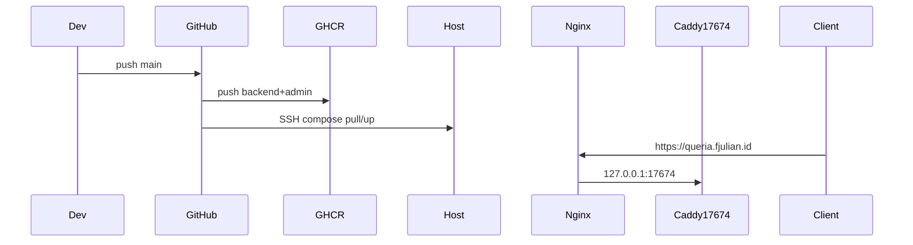

# Production Deployment Runbook

> Status: CURRENT  
> Last verified: 2026-07-21  
> Runtime truth: [`../HANDOFF.md`](../HANDOFF.md)

This runbook documents how Queria reaches production on the shared OCI host.

## Production Host Access

| Field | Value |
|---|---|
| Host | `168.110.214.130` |
| User | `ubuntu` |
| Hostname | `instance-20260518-2039` (Oracle Cloud aarch64) |
| Deploy directory | `/home/ubuntu/queria-backend` |
| Compose file | `docker-compose.production.yml` |
| Edge (Caddy container) | host port **`17674`** (`docker/Caddyfile`) |
| Public subdomain | **`queria.fjulian.id`** → host Nginx → `127.0.0.1:17674` |
| SSH key (local workspace) | `ssh-key-2026-04-16.key` + `.pub` (never commit) |

```bash
ssh -i /Users/fernandojulian/project/knowledge-based-rag/ssh-key-2026-04-16.key ubuntu@168.110.214.130
cd /home/ubuntu/queria-backend
```

Notes:

- Host Nginx owns **80/443** for many sites. Queria’s app edge stays Caddy on **`:17674`**; Nginx only reverse-proxies `queria.fjulian.id`.
- Stack services: postgres, qdrant, minio, `queria-api` / `mcp` / `worker` (image **`backend`**), `queria-admin` (image **`admin`**), `queria-edge` (Caddy).
- GHCR images (arm64 only):  
  `ghcr.io/nandocoeg2/queria-backend/backend:<tag>`  
  `ghcr.io/nandocoeg2/queria-backend/admin:<tag>`



## Deploy paths

| Path | When to use |
|---|---|
| **A — CI / GHCR (primary)** | Normal deploys: push `main` → Actions build arm64 → GHCR → SSH pull/up |
| **B — rsync + host build (fallback)** | GHCR/Actions broken, first cold host without images, or emergency |

### What push `main` does **not** do

| Workflow | Trigger | Output |
|---|---|---|
| **Build & Deploy** ([`deploy.yml`](../../.github/workflows/deploy.yml)) | Push **`main`** (or `workflow_dispatch`) | Host **container** images (`backend` / `admin` on GHCR) + SSH pull/up |
| **Release queria-cli** ([`release-cli.yml`](../../.github/workflows/release-cli.yml)) | Tag **`cli-v*`** only (or Actions → this workflow + optional tag input) | **GitHub Release** assets: multi-arch `queria-cli-*.tar.gz` |

**Do not expect** a new `queria-cli` binary/release from a normal docs or app push to `main`.

### queria-cli Release — operator checklist (one page)

Use this sequence to cut, unstick, or verify CLI assets. Do **not** run Homebrew formula generation until step 4 succeeds.

| Step | Action | Done when |
|---|---|---|
| **0. Preconditions** | Workflow on the commit you tag includes current [`release-cli.yml`](../../.github/workflows/release-cli.yml): **no `macos-13`**, both Darwin targets on **`macos-14`**, Linux arm **optional** (`continue-on-error`). | Matrix matches that (fixed on `main` after retired-runner incident). |
| **1. Cancel stuck run** | Actions → **Release queria-cli** → open hanging run (e.g. **Waiting for a runner…** on `macos-13`) → **Cancel workflow**. | Run shows Cancelled; no zombie jobs. |
| **2. Ship or re-trigger** | Prefer a **new** tag, or retag, or **workflow_dispatch** with tag input (see below). | New Actions run started for that tag. |
| **3. Wait for assets** | Run green (optional Linux arm may fail without blocking). Release page lists archives. | Required assets present (see table). |
| **4. Then formula** | Only after assets are downloadable: `./scripts/generate_homebrew_formula.sh cli-v…` → push tap. | See [`queria-cli-homebrew.md`](./queria-cli-homebrew.md). |

**Required Release assets (publish will fail without them):**

| Asset | Required? |
|---|---|
| `queria-cli-aarch64-apple-darwin.tar.gz` | **Yes** (generator hard-required) |
| `queria-cli-x86_64-unknown-linux-gnu.tar.gz` | **Yes** (generator hard-required) |
| `queria-cli-x86_64-apple-darwin.tar.gz` | **Yes** (generator hard-required; full macOS Intel) |
| `queria-cli-aarch64-unknown-linux-gnu.tar.gz` | Optional (arm Linux; formula `odie` if missing) |

**Archive layout (formula contract):** each tarball expands to a single top-level dir containing the binary **`queria-cli`** (plus `VERSION`):

```text
queria-cli-aarch64-apple-darwin/
  queria-cli
  VERSION
```

#### Cut a new CLI release (happy path)

```bash
# from queria/backend, on the commit you want frozen in the release
git tag -a cli-v0.1.1 -m "queria-cli 0.1.1"
git push origin cli-v0.1.1
# watch: Actions → "Release queria-cli"
# assets: https://github.com/nandocoeg2/queria-backend/releases
```

#### Unstick: tag exists but no usable assets

1. **Cancel** any stuck/failed **Release queria-cli** run for that tag (UI).
2. Re-trigger with one of:

**A — workflow_dispatch (preferred if tag already points at good workflow commit):**

- Actions → **Release queria-cli** → **Run workflow**
- Input `tag`: `cli-v0.1.0` (must be non-empty to publish a GitHub Release)
- Confirm run completes; Release updated with assets

**B — move the tag to a commit that has fixed `release-cli.yml`:**

```bash
git tag -d cli-v0.1.0
git push origin :refs/tags/cli-v0.1.0
# ensure HEAD (or chosen commit) has macos-14 matrix, not macos-13
git tag -a cli-v0.1.0 -m "queria-cli 0.1.0"
git push origin cli-v0.1.0
```

**C — new patch tag** (safest if history is confusing): `cli-v0.1.1` on fixed commit → push → wait.

#### Verify assets (public vs private repo)

```bash
TAG=cli-v0.1.0
# Public (or after release is public): expect HTTP 200
curl -fsI "https://github.com/nandocoeg2/queria-backend/releases/download/${TAG}/queria-cli-aarch64-apple-darwin.tar.gz"

# Private repo: unauthenticated curl returns 404 — not a missing-asset proof.
# Use a token with repo read (do not commit the token):
#   export GH_TOKEN=ghp_…
curl -fsI -H "Authorization: Bearer ${GH_TOKEN}" \
  -H "Accept: application/octet-stream" \
  "https://api.github.com/repos/nandocoeg2/queria-backend/releases/assets/<ASSET_ID>"
# Or: gh release view "$TAG" --repo nandocoeg2/queria-backend
# Or: open Releases UI while logged in
```

**BLOCKED without operator credentials:** live private-asset verification and re-running Actions cannot be proven green from a local agent without `GH_TOKEN` / UI access. Treat missing token + 404 as “verify in UI / with token,” not as “assets absent.”

**Runner note:** never pin `macos-13` — GitHub retired that image (jobs stay **Waiting for a runner…** indefinitely). Darwin x86_64 and aarch64 both build on **`macos-14`**.

Install steps for users: [`onboarding.md`](./onboarding.md) § Install `queria-cli`.  
**Homebrew:** only after step 3 **and** real formula SHAs written by the generator — full formula/tap checklist: [`queria-cli-homebrew.md`](./queria-cli-homebrew.md). Scaffold formula **odies** (not installable). Do not treat Brew as live on `main` alone.

### Residual accuracy (operator — CLI / Brew / cache / Daily)

| Residual | Truth |
|---|---|
| **CLI Release assets** | Not proven green from unauthenticated API (private repo → 404). Confirm in **Actions / Releases UI** or with token. |
| **Push `main`** | Host image deploy only. **No** CLI Release, **no** Homebrew auto-update. |
| **First arm64 deploy** | Seeds GHCR `:buildcache` (full compile once after native-arm + cache work landed; see § Build speed / cache). |
| **Homebrew** | After downloadable `cli-v*` assets → generate real SHAs → push tap. Placeholder is NOT READY. |
| **Daily agent onboard** | Independent — mint/connect/retrieve without CLI or Brew ([`onboarding.md`](./onboarding.md)). |

---

## Path A — CI / GHCR (primary)

### Workflow files

| File | Role |
|---|---|
| [`.github/workflows/deploy.yml`](../../.github/workflows/deploy.yml) | Build `backend` + `admin` (`linux/arm64`), push GHCR, SSH deploy |
| [`.github/workflows/cleanup-ghcr.yml`](../../.github/workflows/cleanup-ghcr.yml) | Keep 5 versions per package; ignore `latest` |
| [`.github/workflows/release-cli.yml`](../../.github/workflows/release-cli.yml) | **Not** a host deploy. Builds `queria-cli` on **tag `cli-v*`** → GitHub Releases |

Triggers for **deploy**: `push` to **`main`**, or Actions → **workflow_dispatch**.

### Build speed / cache (backend + admin images)

| Issue | Cause | Fix in repo |
|---|---|---|
| Multi-hour Rust image build | `linux/arm64` on `ubuntu-latest` via **QEMU** | Job runs on **`ubuntu-24.04-arm`** (native arm64; no QEMU) |
| Cargo rebuilds everything every push | `COPY . .` then one fat `cargo build` | Manifest-first cook + **BuildKit cache mounts** (`cargo` registry/git/target) |
| GHA cache alone cold often | GHA cache eviction / scope miss | **Also** `cache-from/to` registry tag `…/backend:buildcache` and `…/admin:buildcache` on GHCR |

Warm rebuild (deps unchanged): expect cargo mostly cache-hit; cold after `Cargo.lock` bump still compiles deps once into mounts.

Path B (rsync + host `compose build`) does **not** use GHA/registry buildcache unless the host Buildx is configured — native host arm64 is still faster than QEMU CI was.

Notes:

- **First green arm64 deploy after native-runner + cache work (`bf76180` era) still pays a full compile to seed `buildcache`** on GHCR (`backend:buildcache` / `admin:buildcache`). Later pushes with unchanged deps should hit the registry cache — do not expect warm times on that first seed run.
- `GITHUB_TOKEN` packages:write must allow push of `:buildcache` tags (same as `:latest`).
- If `ubuntu-24.04-arm` is unavailable on the org, fall back temporarily to `ubuntu-latest` + QEMU (slow again).

Deploy job (host):

```bash
cd $DEPLOY_PATH
echo "$GHCR_TOKEN" | docker login ghcr.io -u <github-actor> --password-stdin
export GITHUB_REPOSITORY=nandocoeg2/queria-backend
export IMAGE_TAG=<git-sha>
export QUERIA_SOURCE_COMMIT=<git-sha>
docker compose -f docker-compose.production.yml pull
docker compose -f docker-compose.production.yml up -d --remove-orphans
```

Compose also has a local `build:` fallback if you run `compose build` without pull (Path B).

### GitHub Secrets (Environment `Oracle Instance`)

Secrets are **environment** secrets (not repository secrets). Deploy job sets `environment: Oracle Instance` in [`.github/workflows/deploy.yml`](../../.github/workflows/deploy.yml).

UI: repo → **Settings** → **Environments** → **Oracle Instance** → Environment secrets.

| Secret | Purpose |
|---|---|
| `SSH_HOST` | `168.110.214.130` |
| `SSH_USER` | `ubuntu` |
| `SSH_KEY` | Private key material for deploy user |
| `SSH_PORT` | Usually `22` |
| `DEPLOY_PATH` | `/home/ubuntu/queria-backend` |
| `GHCR_TOKEN` | PAT with `read:packages` (host `docker pull`); build/push uses workflow `GITHUB_TOKEN` |

Host `.env` may set `GITHUB_REPOSITORY=nandocoeg2/queria-backend` (compose defaults to that if unset). Do not commit `.env` or tokens.

### First-time or after compose change

CI only pulls images and restarts containers. The host still needs:

- Current `docker-compose.production.yml` and `docker/Caddyfile` (rsync once, or pull from a release artifact)
- Production `.env` (Infisical export; never commit)

Optional one-time migrate after new schema-bearing image:

```bash
docker compose -f docker-compose.production.yml run --rm --no-deps queria-api queria-cli database migrate
# expect {"status":"migrated"}
```

**index-here / Needs review:** after deploy, migrate must apply `knowledge_status` value `needs_review` (`20260719000100_knowledge_status_needs_review`). Smoke checklist: `/healthz` 200, Admin `/admin/needs-review` loads, optional `python3 scripts/e2e_index_here_edge.py` against the edge with a smoke token that has `index_local`.

---

## Path B — rsync + host build (fallback)

Use when Actions/GHCR is unavailable. Host GitHub SSH is often broken; prefer **rsync from workstation**, not `git pull` on the server.

```bash
# workstation
rsync -az --delete \
  --exclude '.git' \
  --exclude 'target' \
  --exclude 'node_modules' \
  --exclude '.env*' \
  /Users/fernandojulian/project/knowledge-based-rag/queria/backend/ \
  ubuntu@168.110.214.130:/home/ubuntu/queria-backend/
```

```bash
# host
cd /home/ubuntu/queria-backend
export QUERIA_SOURCE_COMMIT=$(git rev-parse HEAD 2>/dev/null || echo "rsync-$(date +%Y%m%d)")
docker compose -f docker-compose.production.yml build
docker compose -f docker-compose.production.yml run --rm --no-deps queria-api queria-cli database migrate
docker compose -f docker-compose.production.yml up -d
```

Admin-only rebuild:

```bash
docker compose -f docker-compose.production.yml build queria-admin
docker compose -f docker-compose.production.yml up -d --no-deps queria-admin
```

---

## Pre-flight host checks

- OS: Ubuntu 22.04/24.04 LTS (prod: 24.04 aarch64)
- RAM ≥ 12 GB, free disk generous (multi-service host)
- Docker Engine + Compose plugin active
- Port **17674** free for Caddy; **80/443** owned by Nginx for subdomain TLS

```bash
free -h && nproc && df -h /
systemctl status docker --no-pager
docker ps --format "table {{.Names}}\t{{.Status}}\t{{.Ports}}"
```

## Secrets (Infisical)

```bash
rtk infisical login
rtk infisical export --env=prod --format=dotenv > .env.production
# copy to host deploy dir as .env — never commit
```

Common keys (names only): `DATABASE_PASSWORD`, `QDRANT_API_KEY`, `VOYAGE_API_KEY`, `QUERIA_SETUP_TOKEN`, `QUERIA_FIRST_ADMIN_EMAIL`, `OCI_STORAGE_*`.

---

## Public subdomain: `queria.fjulian.id`

### DNS (Cloudflare)

| Type | Name | Content | Proxy |
|---|---|---|---|
| A | `queria` | `168.110.214.130` | **DNS only (grey cloud)** recommended for Let’s Encrypt HTTP-01; orange cloud needs different cert path |

Verify:

```bash
dig +short queria.fjulian.id A
# expect 168.110.214.130
```

### Nginx reverse proxy → Caddy `:17674`

Snippet in repo: [`docker/nginx-queria.fjulian.id.conf`](../../docker/nginx-queria.fjulian.id.conf).

On host (once; after rsync or scp of the snippet):

```bash
sudo cp /home/ubuntu/queria-backend/docker/nginx-queria.fjulian.id.conf \
  /etc/nginx/sites-available/queria.fjulian.id
sudo ln -sf /etc/nginx/sites-available/queria.fjulian.id /etc/nginx/sites-enabled/
sudo nginx -t && sudo systemctl reload nginx
```

Do **not** replace other vhosts; add only this `server_name`.

### TLS (Certbot / Let’s Encrypt)

Certbot is installed on the host. Issue/renew for the subdomain only:

```bash
# After Nginx site is live on port 80 for queria.fjulian.id
sudo certbot --nginx -d queria.fjulian.id --non-interactive --agree-tos \
  -m nando@fjulian.id --redirect
```

If Certbot is unavailable or DNS still proxied orange:

```bash
sudo certbot certonly --webroot -w /var/www/html -d queria.fjulian.id
# then wire ssl_certificate paths into the Nginx server block and reload
```

Renewal is usually via systemd timer (`certbot.timer`). Test: `sudo certbot renew --dry-run`.

Caddy inside Docker does **not** terminate public HTTPS for this domain; Nginx does.

---

## Verification (smoke)

**Authoritative app edge (always):**

```bash
curl -i http://168.110.214.130:17674/healthz
# expect 200, body OK, Server: Caddy
```

**Via subdomain (after Nginx + cert):**

```bash
curl -i https://queria.fjulian.id/healthz
# expect 200
```

**Admin:** `https://queria.fjulian.id/admin/login` (or `http://168.110.214.130:17674/admin/login`).

**Compose:**

```bash
cd /home/ubuntu/queria-backend
docker compose -f docker-compose.production.yml ps
```

Treat domain failures as proxy/DNS/TLS until `:17674` smoke also fails.

## Related

| Doc | Use |
|---|---|
| [`../HANDOFF.md`](../HANDOFF.md) | Deployed commit, stack identity |
| [`rollback.md`](./rollback.md) | Known-good rebuild without volume wipe |
| [`onboarding.md`](./onboarding.md) | Post-deploy admin/agent path |
| [`local-development.md`](./local-development.md) | Local compose ports/env |
