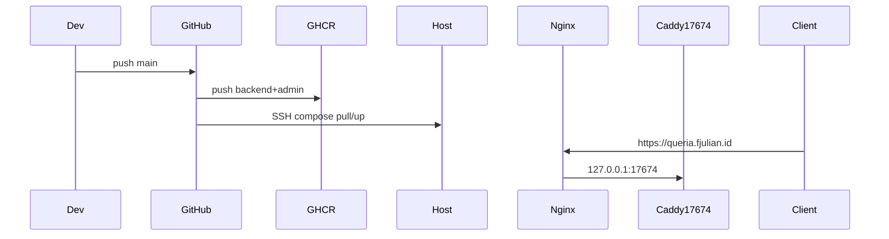

# Production Deployment Runbook

> Status: CURRENT  
> Last verified: 2026-07-19  
> Runtime truth: [`../HANDOFF.md`](../HANDOFF.md)

This runbook documents how Queria reaches production on the shared OCI host.

## Production Host Access

| Field | Value |
|---|---|
| Host | `168.110.214.130` |
| User | `ubuntu` |
| Hostname | `instance-20260518-2039` (Oracle Cloud aarch64) |
| Deploy directory | `/home/ubuntu/queria-backend` |
| Compose file | `docker-compose.production.yml` |
| Edge (Caddy container) | host port **`17674`** (`docker/Caddyfile`) |
| Public subdomain | **`queria.fjulian.id`** → host Nginx → `127.0.0.1:17674` |
| SSH key (local workspace) | `ssh-key-2026-04-16.key` + `.pub` (never commit) |

```bash
ssh -i /Users/fernandojulian/project/knowledge-based-rag/ssh-key-2026-04-16.key ubuntu@168.110.214.130
cd /home/ubuntu/queria-backend
```

Notes:

- Host Nginx owns **80/443** for many sites. Queria’s app edge stays Caddy on **`:17674`**; Nginx only reverse-proxies `queria.fjulian.id`.
- Stack services: postgres, qdrant, minio, `queria-api` / `mcp` / `worker` (image **`backend`**), `queria-admin` (image **`admin`**), `queria-edge` (Caddy).
- GHCR images (arm64 only):  
  `ghcr.io/nandocoeg2/queria-backend/backend:<tag>`  
  `ghcr.io/nandocoeg2/queria-backend/admin:<tag>`



## Deploy paths

| Path | When to use |
|---|---|
| **A — CI / GHCR (primary)** | Normal deploys: push `main` → Actions build arm64 → GHCR → SSH pull/up |
| **B — rsync + host build (fallback)** | GHCR/Actions broken, first cold host without images, or emergency |

---

## Path A — CI / GHCR (primary)

### Workflow files

| File | Role |
|---|---|
| [`.github/workflows/deploy.yml`](../../.github/workflows/deploy.yml) | Build `backend` + `admin` (`linux/arm64`), push GHCR, SSH deploy |
| [`.github/workflows/cleanup-ghcr.yml`](../../.github/workflows/cleanup-ghcr.yml) | Keep 5 versions per package; ignore `latest` |

Triggers: `push` to **`main`**, or Actions → **workflow_dispatch**.

Deploy job (host):

```bash
cd $DEPLOY_PATH
echo "$GHCR_TOKEN" | docker login ghcr.io -u <github-actor> --password-stdin
export GITHUB_REPOSITORY=nandocoeg2/queria-backend
export IMAGE_TAG=<git-sha>
export QUERIA_SOURCE_COMMIT=<git-sha>
docker compose -f docker-compose.production.yml pull
docker compose -f docker-compose.production.yml up -d --remove-orphans
```

Compose also has a local `build:` fallback if you run `compose build` without pull (Path B).

### GitHub Secrets (repo `queria-backend`)

| Secret | Purpose |
|---|---|
| `SSH_HOST` | `168.110.214.130` |
| `SSH_USER` | `ubuntu` |
| `SSH_KEY` | Private key material for deploy user |
| `SSH_PORT` | Usually `22` |
| `DEPLOY_PATH` | `/home/ubuntu/queria-backend` |
| `GHCR_TOKEN` | PAT with `read:packages` (host `docker pull`); build/push uses workflow `GITHUB_TOKEN` |

Host `.env` may set `GITHUB_REPOSITORY=nandocoeg2/queria-backend` (compose defaults to that if unset). Do not commit `.env` or tokens.

### First-time or after compose change

CI only pulls images and restarts containers. The host still needs:

- Current `docker-compose.production.yml` and `docker/Caddyfile` (rsync once, or pull from a release artifact)
- Production `.env` (Infisical export; never commit)

Optional one-time migrate after new schema-bearing image:

```bash
docker compose -f docker-compose.production.yml run --rm --no-deps queria-api queria-cli database migrate
# expect {"status":"migrated"}
```

---

## Path B — rsync + host build (fallback)

Use when Actions/GHCR is unavailable. Host GitHub SSH is often broken; prefer **rsync from workstation**, not `git pull` on the server.

```bash
# workstation
rsync -az --delete \
  --exclude '.git' \
  --exclude 'target' \
  --exclude 'node_modules' \
  --exclude '.env*' \
  --exclude '_cicd' \
  /Users/fernandojulian/project/knowledge-based-rag/queria/backend/ \
  ubuntu@168.110.214.130:/home/ubuntu/queria-backend/
```

```bash
# host
cd /home/ubuntu/queria-backend
export QUERIA_SOURCE_COMMIT=$(git rev-parse HEAD 2>/dev/null || echo "rsync-$(date +%Y%m%d)")
docker compose -f docker-compose.production.yml build
docker compose -f docker-compose.production.yml run --rm --no-deps queria-api queria-cli database migrate
docker compose -f docker-compose.production.yml up -d
```

Admin-only rebuild:

```bash
docker compose -f docker-compose.production.yml build queria-admin
docker compose -f docker-compose.production.yml up -d --no-deps queria-admin
```

---

## Pre-flight host checks

- OS: Ubuntu 22.04/24.04 LTS (prod: 24.04 aarch64)
- RAM ≥ 12 GB, free disk generous (multi-service host)
- Docker Engine + Compose plugin active
- Port **17674** free for Caddy; **80/443** owned by Nginx for subdomain TLS

```bash
free -h && nproc && df -h /
systemctl status docker --no-pager
docker ps --format "table {{.Names}}\t{{.Status}}\t{{.Ports}}"
```

## Secrets (Infisical)

```bash
rtk infisical login
rtk infisical export --env=prod --format=dotenv > .env.production
# copy to host deploy dir as .env — never commit
```

Common keys (names only): `DATABASE_PASSWORD`, `QDRANT_API_KEY`, `VOYAGE_API_KEY`, `QUERIA_SETUP_TOKEN`, `QUERIA_FIRST_ADMIN_EMAIL`, `OCI_STORAGE_*`.

---

## Public subdomain: `queria.fjulian.id`

### DNS (Cloudflare)

| Type | Name | Content | Proxy |
|---|---|---|---|
| A | `queria` | `168.110.214.130` | **DNS only (grey cloud)** recommended for Let’s Encrypt HTTP-01; orange cloud needs different cert path |

Verify:

```bash
dig +short queria.fjulian.id A
# expect 168.110.214.130
```

### Nginx reverse proxy → Caddy `:17674`

Snippet in repo: [`docker/nginx-queria.fjulian.id.conf`](../../docker/nginx-queria.fjulian.id.conf).

On host (once; after rsync or scp of the snippet):

```bash
sudo cp /home/ubuntu/queria-backend/docker/nginx-queria.fjulian.id.conf \
  /etc/nginx/sites-available/queria.fjulian.id
sudo ln -sf /etc/nginx/sites-available/queria.fjulian.id /etc/nginx/sites-enabled/
sudo nginx -t && sudo systemctl reload nginx
```

Do **not** replace other vhosts; add only this `server_name`.

### TLS (Certbot / Let’s Encrypt)

Certbot is installed on the host. Issue/renew for the subdomain only:

```bash
# After Nginx site is live on port 80 for queria.fjulian.id
sudo certbot --nginx -d queria.fjulian.id --non-interactive --agree-tos \
  -m nando@fjulian.id --redirect
```

If Certbot is unavailable or DNS still proxied orange:

```bash
sudo certbot certonly --webroot -w /var/www/html -d queria.fjulian.id
# then wire ssl_certificate paths into the Nginx server block and reload
```

Renewal is usually via systemd timer (`certbot.timer`). Test: `sudo certbot renew --dry-run`.

Caddy inside Docker does **not** terminate public HTTPS for this domain; Nginx does.

---

## Verification (smoke)

**Authoritative app edge (always):**

```bash
curl -i http://168.110.214.130:17674/healthz
# expect 200, body OK, Server: Caddy
```

**Via subdomain (after Nginx + cert):**

```bash
curl -i https://queria.fjulian.id/healthz
# expect 200
```

**Admin:** `https://queria.fjulian.id/admin/login` (or `http://168.110.214.130:17674/admin/login`).

**Compose:**

```bash
cd /home/ubuntu/queria-backend
docker compose -f docker-compose.production.yml ps
```

Treat domain failures as proxy/DNS/TLS until `:17674` smoke also fails.

## Related

| Doc | Use |
|---|---|
| [`../HANDOFF.md`](../HANDOFF.md) | Deployed commit, stack identity |
| [`rollback.md`](./rollback.md) | Known-good rebuild without volume wipe |
| [`onboarding.md`](./onboarding.md) | Post-deploy admin/agent path |
| [`local-development.md`](./local-development.md) | Local compose ports/env |
