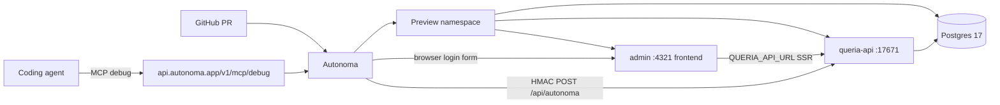

# Autonoma Maximization for Queria (Agent Debug Loop)

> Status: APPROVED design (brainstorm 2026-07-18). Ponytail-trimmed. Not implemented.
> Repo: `nandocoeg2/queria-backend` (`queria/backend`)
> North star: maximize Autonoma so coding agents auto-debug failed PR previews via Autonoma MCP.
> Topology: **B — Agent-velocity** (lean always-on preview; deeper slices later).
> Product truth: [`HANDOFF.md`](../../HANDOFF.md), [`PRODUCT.md`](../../PRODUCT.md), [`ARCHITECTURE.md`](../../ARCHITECTURE.md).

## Goal

Use Autonoma as the PR-native quality + agent-debugging surface for Queria Admin and API.

Maximize **agent-fixable signal**, not maximum infra fidelity:

1. Every PR gets a live preview that deploys reliably and quickly.
2. Environment Factory seeds real org/admin/project state.
3. Planner-generated NL suite hits high-signal Admin flows.
4. Coding agents use Autonoma MCP (`get_investigation` → diagnose → fix → `wait_for_deploy`) without humans pasting dashboard logs.

**Out of scope (v1):** Scout, multi-repo previews, production Environment Factory mount, Worker/Git ingestion E2E, MCP tool E2E, golden eval in Autonoma.

## Fixed Decisions

| Concern | Decision |
|---|---|
| Primary outcome | Agent loop: agents fix failed previews via Autonoma MCP |
| Topology | B — Admin + API + Postgres always; Qdrant/Voyage/MCP/Worker later |
| GitHub repo | `nandocoeg2/queria-backend` |
| Frontend app | Admin Astro (only browser entry; `frontend=true`) |
| Backend under test | `queria-api` |
| Auth for runners | **Pattern 3 only for v1**: factory User with known password; suite logs in via real Admin login form. Revisit Pattern 1 (`queria_session` cookie inject) only if multi-host cookie proves needed. |
| Factory mount | `POST /api/autonoma` on API, **only** when `AUTONOMA_PREVIEWKIT` (or non-production guard) |
| scope_field | `organization_id` |
| Build method | Existing Dockerfiles (API root `Dockerfile`, `admin/Dockerfile`) |
| Edge in preview | No Caddy v1; Admin → `QUERIA_API_URL` → API internal URL |
| Session cookie | Production still uses `queria_session` (HttpOnly, SameSite=Lax, Path=/); factory seeds User for form login, not cookie injection |
| Secrets | Autonoma encrypted secrets; never commit; MCP never returns secret values |
| Existing Playwright | Keep for local/CI string contracts; Autonoma owns PR exploratory + regression NL suite |

## Architecture (v1 always-on)



### Apps

| Name | Role | Build | Port | Health | Notes |
|---|---|---|---|---|---|
| `admin` | Frontend (toggle on) | `admin/Dockerfile` | `4321` | unauth path that returns 200 (e.g. `/admin/login`) | Agents open this URL |
| `api` | Backend | root `Dockerfile`, start `queria-api` | `17671` | `/healthz` | Hosts Environment Factory |

Wire via Autonoma connection templates:

- Admin runtime: `QUERIA_API_URL=http://api:17671` (or platform DNS name Autonoma assigns).
- API runtime: `QUERIA_DATABASE_URL` from Postgres connection template.
- API runtime: `AUTONOMA_SHARED_SECRET`, `AUTONOMA_SIGNING_SECRET` (secrets).
- Optional later: `VOYAGE_API_KEY`, `QUERIA_QDRANT_URL` when retrieval slice is on.

### Database

- Engine: **Postgres 17** (match compose intent; pin version Autonoma supports closest to 17).
- On create: run migrations via `queria-cli` already in the API image.
- Every commit: re-run migrate so PR schema matches branch.
- No Qdrant in always-on v1. Admin Playground and retrieval endpoints must **fail open** with a clear empty/error UI when vector backend is absent (detect preview via `AUTONOMA_PREVIEWKIT`).

### Why no Caddy in v1

Prod uses Caddy for `/api/*` → API and `/admin` → Admin. In preview, multi-app Autonoma already gives each app a URL. Admin already server-side proxies to API with cookie forward (`admin/src/lib/api.ts`). Reproducing Caddy adds one more failure mode without increasing browser coverage.

### Login path (v1)

Factory creates User with a **known hashed password**. Auth callback returns Pattern 3 credentials:

```text
credentials: { email: <factory user email>, password: <known factory password> }
```

Suite / Autonoma runner logs in through the real Admin login form. That exercises Admin SSR cookie rewrite the same way production does, without multi-host cookie injection.

## Environment Factory

### Mount and security

- Route: `POST /api/autonoma` on `queria-api` (Axum, `autonoma_sdk` Rust).
- Enable when `AUTONOMA_PREVIEWKIT` is set **or** explicit non-production flag for local validation.
- **Never** mount on production public edge.
- `shared_secret`: HMAC with Autonoma. `signing_secret`: private to API; distinct from shared.
- Factories call **real** create paths (same password hashing as production). No raw SQL bypass.

### Factories (v1)

| Model | Create | Teardown | Notes |
|---|---|---|---|
| `Organization` | yes | yes | scope root |
| `User` | yes | optional | Admin email; hash **known** password for Pattern 3 |
| `Project` | yes | yes | `_ref` org; slug deterministic per scenario |

Defer until suite needs them: AgentToken, KnowledgeItem, Approval, Source, IngestionJob.

### Auth callback

```text
credentials: { email, password: <known factory password> }
```

Handle `user == null` safely (scenarios without User).

### Validation gate (before planner suite)

1. `discover` via HMAC returns models + `scopeField=organization_id`.
2. Scenario up: Org + User + Project exist.
3. Pattern 3 login via Admin form reaches dashboard; `/api/v1/auth/me` works via Admin SSR cookie forward.
4. Scenario down: no orphan org-scoped rows / sessions for that scope.
5. Prefer validation on a `feat: autonoma-sdk` PR preview.

## Planner suite (v1)

Run planner from repo root (`queria-backend`).

### Include

1. Unauthenticated visit redirects or shows login.
2. Login with factory credentials lands dashboard.
3. Projects list shows seeded project; open project detail.
4. Approvals queue loads (empty OK).
5. Playground page loads without crash when Qdrant/Voyage absent (fail-open).

### Exclude

- Setup wizard (factory always seeds org in v1)
- Git source connect + Worker ingest
- MCP browser coverage
- Token create/revoke destructive flows
- Golden eval CLI
- Production secrets / real Voyage cost paths

### Suite maintenance

- Review planner checkpoints before accepting generated suite.
- Prefer fewer stable scenarios over broad flaky coverage.
- Map failures to app bug, factory/auth bug, or preview config (agent classifies via MCP).

## How we maximize Autonoma (four levers)

1. **Preview** — lean Admin + API + Postgres; loud health (`/healthz`, Admin login 200).
2. **Factory** — real services + known password User → less flake, real product bugs.
3. **Planner** — only the five flows above; after factory proven.
4. **Debug MCP** — AGENTS.md loop after every PR: investigation → logs/secrets → fix → `wait_for_deploy`.

### Agent loop contract (commit to AGENTS.md)

```markdown
After you push a PR, Autonoma reviews its preview deploy and NL suite.
If Autonoma flagged a problem:
1. Use Autonoma MCP: get_investigation → diagnose_deploy → get_build_logs / get_app_logs / get_secret_status.
2. Fix in repo when the root cause is code or config-as-code.
3. Use set_secret only for missing secret values; edit_previewkit_config / apply_config for preview wiring.
4. wait_for_deploy until settled; re-check investigation.
5. Do not merge while deploy or suite is red unless human overrides.
Secrets are never printed; compare fingerprints only.
```

MCP endpoint: `https://api.autonoma.app/v1/mcp/debug` (Streamable HTTP, OAuth).

## Phased delivery

### Phase 0 — Account and GitHub

- Install Autonoma GitHub App on `nandocoeg2/queria-backend`.
- Create Autonoma project; MCP OAuth access ready.

### Phase 1 — Preview green (unblocks MCP debug)

- Configure Admin + API + Postgres in Autonoma dashboard.
- Migrations on create + every commit.
- Secrets minimum set for API boot.
- Open PR; confirm preview URL, health, deploy status via MCP tools.
- **Gate:** agent diagnoses broken health path or missing DB URL without dashboard paste.

### Phase 2 — Environment Factory

- Add `autonoma-sdk` + Axum route (preview-only).
- Org / User / Project factories + Pattern 3 auth callback.
- Validate discover + up/down + Admin form login → dashboard.
- **Gate:** agent can fix factory/auth bugs from investigation output.

### Phase 3 — Planner suite

- Run planner; accept only the five v1 scenarios.
- Wire suite to PR runs.
- **Gate:** suite fails on real Admin regressions; agent uses findings + screenshots.

### Phase 4 — Agent workflow polish

- Commit AGENTS.md Autonoma loop block only.

Later only if Phases 1–3 are green: Qdrant/Voyage, MCP app, Worker.

## Failure classes (quick map)

| Symptom | Fix style |
|---|---|
| Deploy never ready / crash loop | `diagnose_deploy` + logs/secrets → health, port, env, migrate command |
| All tests fail at login | factory password / credentials callback / Admin login form |
| Flaky suite | narrow NL steps; stabilize factory data |

## Non-goals

- Do not replace Rust contract tests or Admin Playwright smoke.
- Do not store Voyage production traffic expectations on every PR.
- Do not expose factory endpoint on production host.
- Do not put real production passwords or agent tokens in planner prompts.

## Open implementation notes

1. Confirm Autonoma Postgres major if 17 unavailable; use closest and document drift.
2. Prefer migrate via already-built `queria-cli` in the API image.
3. Admin health check path must not require auth.

## References

- Autonoma: https://docs.autonoma.app/ (llms.txt)
- Preview apps: https://docs.autonoma.app/preview-environments/apps/
- Environment Factory setup: https://docs.autonoma.app/environment-factory/setup/
- Rust/Axum factory example: https://docs.autonoma.app/environment-factory/examples/rust/
- Debug MCP: https://docs.autonoma.app/mcp/
- Planner: https://docs.autonoma.app/test-planner/
