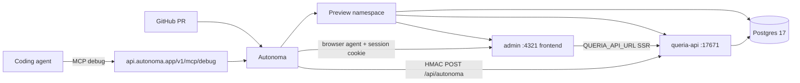

# Autonoma Maximization for Queria (Agent Debug Loop)

> Status: APPROVED design (brainstorm 2026-07-18). Not implemented.
> Repo: `nandocoeg2/queria-backend` (`queria/backend`)
> North star: maximize Autonoma so coding agents auto-debug failed PR previews via Autonoma MCP.
> Topology: **B — Agent-velocity** (lean always-on preview; deeper slices later).
> Product truth: [`HANDOFF.md`](../../HANDOFF.md), [`PRODUCT.md`](../../PRODUCT.md), [`ARCHITECTURE.md`](../../ARCHITECTURE.md).

## Goal

Use Autonoma as the PR-native quality + agent-debugging surface for Queria Admin and API.

Maximize **agent-fixable signal**, not maximum infra fidelity:

1. Every PR gets a live preview that deploys reliably and quickly.
2. Environment Factory seeds real org/admin/project state with real sessions.
3. Planner-generated NL suite hits high-signal Admin flows.
4. Coding agents use Autonoma MCP (`get_investigation` → diagnose → fix → `wait_for_deploy`) without humans pasting dashboard logs.

**Out of scope (v1):** Scout, multi-repo previews, production Environment Factory mount, Worker/Git ingestion E2E, MCP tool E2E, golden eval in Autonoma.

## Fixed Decisions

| Concern | Decision |
|---|---|
| Primary outcome | Agent loop: agents fix failed previews via Autonoma MCP |
| Topology | B — Admin + API + Postgres always; Qdrant/Voyage/MCP/Worker later |
| GitHub repo | `nandocoeg2/queria-backend` |
| Frontend app | Admin Astro (only browser entry; `frontend=true`) |
| Backend under test | `queria-api` |
| Auth for runners | Pattern 1: real `queria_session` cookie (Admin SSR already forwards Cookie to API) |
| Auth fallback | Pattern 3: email + known factory password if cookie domain issues appear |
| Factory mount | `POST /api/autonoma` on API, **only** when `AUTONOMA_PREVIEWKIT` (or non-production guard) |
| scope_field | `organization_id` |
| Build method | Existing Dockerfiles (API root `Dockerfile`, `admin/Dockerfile`) |
| Edge in preview | No Caddy v1; Admin → `QUERIA_API_URL` → API internal URL |
| Session cookie | `queria_session` (HttpOnly, SameSite=Lax, Path=/) as implemented today |
| Secrets | Autonoma encrypted secrets; never commit; MCP never returns secret values |
| Existing Playwright | Keep for local/CI string contracts; Autonoma owns PR exploratory + regression NL suite |

## Architecture (v1 always-on)



### Apps

| Name | Role | Build | Port | Health | Notes |
|---|---|---|---|---|---|
| `admin` | Frontend (toggle on) | `admin/Dockerfile` | `4321` | path that returns 200 for cold UI (e.g. `/admin/login` or `/`) | Agents open this URL |
| `api` | Backend | root `Dockerfile`, start `queria-api` | `17671` | `/healthz` (existing `queria-api` health) | Hosts Environment Factory |

Wire via Autonoma connection templates:

- Admin runtime: `QUERIA_API_URL=http://api:17671` (or platform DNS name Autonoma assigns).
- API runtime: `QUERIA_DATABASE_URL` from Postgres connection template.
- API runtime: `AUTONOMA_SHARED_SECRET`, `AUTONOMA_SIGNING_SECRET` (secrets).
- Optional later: `VOYAGE_API_KEY`, `QUERIA_QDRANT_URL` when retrieval slice is on.

### Database

- Engine: **Postgres 17** (match compose intent; pin version Autonoma supports closest to 17).
- On create: run migrations (prefer image that already has `queria-cli` or API migrate path used in production entry).
- Every commit: re-run migrate so PR schema matches branch.
- No Qdrant in always-on v1. Admin Playground and retrieval endpoints must **fail open** with a clear empty/error UI when vector backend is absent (detect preview via `AUTONOMA_PREVIEWKIT`).

### Why no Caddy in v1

Prod uses Caddy for `/api/*` → API and `/admin` → Admin. In preview, multi-app Autonoma already gives each app a URL. Admin already server-side proxies to API with cookie forward (`admin/src/lib/api.ts`). Reproducing Caddy adds one more failure mode for agents without increasing browser coverage. Revisit only if cookie/`Set-Cookie` rewriting becomes unmanageable.

### Multi-host cookie model (important)

Today:

1. Browser posts login form to Admin SSR.
2. Admin calls API `/api/v1/auth/login`.
3. API sets `Set-Cookie: queria_session=...`.
4. Admin rewrites that cookie onto the **browser response for the Admin host**.
5. Later Admin SSR reads browser Cookie and forwards it to API.

For Autonoma Pattern 1 auth callback: return `cookies: [{ name: "queria_session", value: <raw session token>, httpOnly: true, sameSite: "lax", path: "/" }]`. Autonoma must attach the cookie to the **Admin (frontend) origin**, not the API origin. That matches production browser behavior.

If Autonoma injects only on the wrong host, switch auth callback to Pattern 3 credentials and keep factory User password known; suite logs in via the real login form.

## Environment Factory

### Mount and security

- Route: `POST /api/autonoma` on `queria-api` (Axum, `autonoma_sdk` Rust).
- Enable when `AUTONOMA_PREVIEWKIT` is set (Autonoma injects this) **or** explicit non-production flag for local validation.
- **Never** mount on production public edge.
- `shared_secret`: HMAC with Autonoma (also set in Autonoma secrets).
- `signing_secret`: private to API; never shared; distinct from shared.
- Factories call **real** create paths (same hashing/session issuance as production). No raw SQL bypass.

### Factories (v1)

| Model | Create | Teardown | Notes |
|---|---|---|---|
| `Organization` | yes | yes | scope root |
| `User` | yes | optional (delete if cheap) | Admin email; hash known password for Pattern 3 fallback |
| `Project` | yes | yes | `_ref` org; slug deterministic per scenario |

Defer v1: AgentToken, KnowledgeItem, Approval, Source, IngestionJob (add when suite needs them).

### Auth callback

Prefer Pattern 1:

1. Resolve first factory User (or null-safe).
2. `SessionIssuer.issue_session_token()` + `create_session` (same as login handler).
3. Return cookie `queria_session` with raw token, HttpOnly, SameSite=Lax, Path=/, Max-Age ≥ 3600.

Fallback Pattern 3:

```text
credentials: { email, password: <known factory password> }
```

### Validation gate (before planner suite)

1. `discover` via HMAC curl returns models + `scopeField=organization_id`.
2. Scenario up: Org + User + Project exist.
3. Auth cookie authenticates Admin `/admin` and API `/api/v1/auth/me` (via Admin or API with cookie).
4. Scenario down: no orphan org-scoped rows / sessions for that scope.
5. Prefer Autonoma Finish-setup validation on a `feat: autonoma-sdk` PR preview.

## Planner suite (v1 prioritization)

Run planner from repo root (`queria-backend`) so it sees Admin pages and API crates.

### Include (high signal, agent-fixable)

1. Unauthenticated visit redirects or shows login.
2. Login with factory credentials / session lands dashboard.
3. Projects list shows seeded project; open project detail.
4. Approvals queue loads (empty OK).
5. Playground page loads without crash when Qdrant/Voyage absent (fail-open).
6. Setup wizard only when factory does **not** seed org (optional negative path).

### Exclude (v1)

- Git source connect + Worker ingest
- MCP `retrieve_context` / `index_memory` browser coverage
- Token create/revoke destructive flows
- Golden eval CLI
- Production secret values or real Voyage cost paths

### Suite maintenance

- Review planner checkpoints (pages, models, scenarios) before accepting generated suite.
- Prefer fewer stable scenarios over broad flaky coverage.
- Map failures to either: app bug, factory/auth bug, or preview config (agent uses MCP to classify).

## Maximizing Autonoma capabilities (explicit leverage)

Autonoma value stack and how Queria uses each:

| Capability | Maximize how |
|---|---|
| **Preview environments** | Lean always-on stack; Dockerfile builds already ship; health checks that fail loud (`/healthz`, Admin login 200). Main-branch standing preview optional for smoke. |
| **Secrets + connections** | Template DB URLs; secrets only in Autonoma; declare build vs runtime secrets correctly so agents use `set_secret` without rebuild thrash when possible. |
| **Environment Factory** | Real services + real sessions → less flake → investigations point at real product bugs. |
| **Test Planner** | Focus Admin critical paths; submit recipe after factory proven. |
| **PR review comments** | Treat Autonoma PR comment as agent entrypoint (findings + screenshots). |
| **Debug MCP** | Wire into coding agents; AGENTS.md force-check after PR push. Tools: `get_investigation`, `diagnose_deploy`, `get_build_logs`, `get_app_logs`, `get_secret_status`, `set_secret`, `edit_previewkit_config`, `apply_config`, `wait_for_deploy`. |
| **Onboarding MCP** | Optional one-time: configure preview via Autonoma onboarding MCP instead of dashboard-only. |
| **Issue verify loop** | After agent fixes, push and wait for redeploy + suite re-run (not manual retest). |

### Agent loop contract (must land in repo agent instructions)

Add to `AGENTS.md` / admin `AGENTS.md` (or backend root agent file):

```markdown
After you push a PR, Autonoma reviews its preview deploy and NL suite.
If Autonoma flagged a problem:
1. Use Autonoma MCP: get_investigation → diagnose_deploy → get_build_logs / get_app_logs / get_secret_status.
2. Fix in repo when the root cause is code or config-as-code.
3. Use set_secret only for missing secret values; edit_previewkit_config / apply_config for preview wiring.
4. wait_for_deploy until settled; re-check investigation.
5. Do not merge while deploy or suite is red unless human overrides.
Secrets are never printed; compare fingerprints only.
```

MCP endpoint: `https://api.autonoma.app/v1/mcp/debug` (Streamable HTTP, OAuth).

Clients: Claude Code / Cursor / Copilot as already used by maintainers.

## Phased delivery (maximize early agent loop)

### Phase 0 — Account and GitHub

- Install Autonoma GitHub App on `nandocoeg2/queria-backend`.
- Create Autonoma project; note org access for MCP OAuth.

### Phase 1 — Preview green (unblocks MCP debug)

- Configure Admin + API + Postgres in Autonoma dashboard (or onboarding MCP).
- Migrations on create + every commit.
- Secrets minimum set for API boot.
- Open PR; confirm preview URL, health, deploy status via MCP tools.
- Success: agent can diagnose a broken health path or missing DB URL without dashboard paste.

### Phase 2 — Environment Factory

- Add `autonoma-sdk` + Axum route (preview-only).
- Org / User / Project factories + session auth callback.
- Validate discover + up/down + Admin authenticated dashboard load.
- Success: agent can fix factory/auth bugs from investigation output.

### Phase 3 — Planner suite

- Run planner; accept only v1 priority scenarios.
- Wire suite to PR runs.
- Success: suite fails on real Admin regressions; agent uses findings + screenshots.

### Phase 4 — Agent workflow polish

- Commit AGENTS.md Autonoma loop.
- Document secret fingerprints and common failure classes in a short runbook.
- Optional: main-branch standing preview.

### Phase 5+ — Fidelity slices (when agent loop is healthy)

| Slice | Adds | Unlocks suite |
|---|---|---|
| Retrieval | Qdrant service + Voyage secret; fail-open off for Playground assert | Playground probe returns chunks |
| MCP app | `queria-mcp` container | Agent-tool contract still mostly out of browser; HTTP smoke only if needed |
| Worker | `queria-worker` + optional MinIO | Ingestion job UI later |

Do **not** add slices until Phase 1–3 false-positive rate is acceptable.

## Failure classes and agent response

| Symptom | Likely cause | Agent first tools | Fix style |
|---|---|---|---|
| Deploy never ready | Health path/port wrong | `diagnose_deploy`, `get_app_logs` | `edit_previewkit_config` or code health route |
| API crash loop | Missing env / bad DATABASE_URL | `get_secret_status`, logs | `set_secret` or connection template |
| Migrate fail | Schema/CLI entrypoint | build + app logs | migration or setup task command |
| All tests fail at login | Auth callback / cookie host | investigation | factory auth or Pattern 3 |
| Dashboard 401 after cookie | Cookie not forwarded / wrong name | investigation + logs | Admin `api.ts` / cookie rewrite |
| Playground crash | Voyage/Qdrant required hard | logs | fail-open for `AUTONOMA_PREVIEWKIT` |
| Flaky suite | Over-specific NL steps | investigation | narrow scenario / factory data |

## Non-goals and guardrails

- Do not replace Rust contract tests or Admin Playwright smoke.
- Do not store Voyage production traffic expectations on every PR (cost).
- Do not expose factory endpoint on production host.
- Do not put real production passwords or agent tokens in planner prompts.
- Do not expand to dual full-stack preview modes until lean path is stable.

## Success metrics

| Metric | Target |
|---|---|
| Preview ready rate on green PRs | High; cold start acceptable under Autonoma norms |
| Time to first agent self-heal of a known broken secret/port | One PR cycle without human log paste |
| Suite signal | Failures mostly real product bugs after factory stable |
| v1 surface coverage | Login, dashboard, projects, approvals, playground load |
| Production safety | Factory absent; no Autonoma secrets required on prod |

## Open implementation notes (for plan, not open product questions)

1. Confirm exact Autonoma Postgres major if “17” unavailable; use 16 only if forced and document drift.
2. Prefer migrate command that uses already-built `queria-cli` in the API image (image already builds `queria-cli`).
3. Admin health check path must not require auth.
4. Document cookie name `queria_session` in factory auth so agents do not invent alternate cookies.
5. Playwright remains local/CI; no requirement to delete it.

## References

- Autonoma: https://docs.autonoma.app/ (llms.txt)
- Preview apps: https://docs.autonoma.app/preview-environments/apps/
- Environment Factory setup: https://docs.autonoma.app/environment-factory/setup/
- Rust/Axum factory example: https://docs.autonoma.app/environment-factory/examples/rust/
- Debug MCP: https://docs.autonoma.app/mcp/
- Planner: https://docs.autonoma.app/test-planner/
